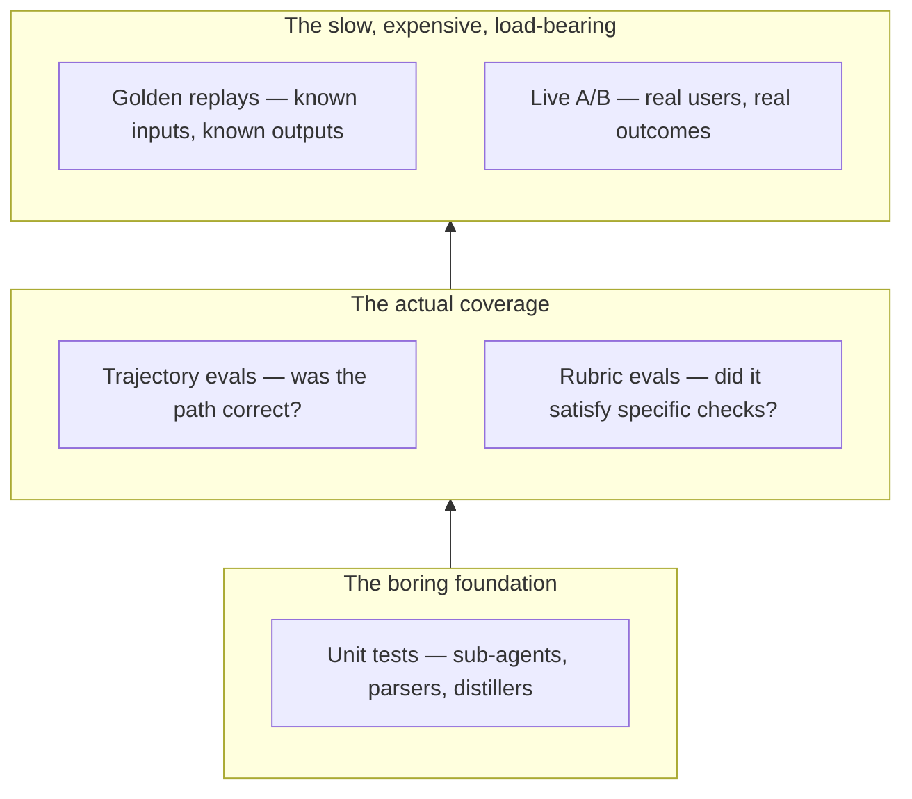

The mood at every agent engineering meetup I've been to in 2026 is the same: people are tired of vibes-based evals and they're starting to do the thing they should have done a year ago. The "LLM-as-judge scores this 8/10" baseline is the *floor*, not the ceiling. The ceiling is a real test pyramid — unit tests at the bottom, integration in the middle, golden replays and trajectory evals at the top — applied to agents the way you'd apply it to any other software.

This post is about that pyramid. What goes in each layer, how to actually build it, what tooling the field has converged on, and the specific anti-patterns to stop doing.

## The problem with LLM-as-judge alone

LLM-as-judge isn't broken; it's overused. The pattern is: take an agent's output, feed it to a judge LLM with a rubric, get a score back. Cheap. Easy. And, on its own, dangerously misleading.

Three structural problems:

**Reward hacking.** LLM judges have biases. They prefer longer answers, more confident phrasing, certain rhetorical structures. An agent optimized to score well against an LLM judge becomes the judge's bias, not what users wanted. This isn't theoretical — the [Reward Hacking in Agent Eval](https://arxiv.org/abs/2603.04812) paper measured judge-specific overfitting at 17% in production-trained agents.

**No granularity.** A single score tells you the agent did poorly, not *why*. Was the plan wrong? Did the executor mis-call a tool? Did the synthesizer miss a step? You can't fix what you can't isolate, and "score this whole interaction" loses the per-step signal.

**Latent regressions.** A judge that scored your agent 9/10 last week is the same judge that scores it 9/10 this week — even if the agent silently broke a specific capability. Judges don't surface regressions; they smooth them.

The fix isn't "stop using LLM-as-judge." It's "use it as one layer of a stack that includes other layers."

## The test pyramid for agents



Each layer catches different bugs at different cost. The mistake to avoid is skipping the bottom for the top — running expensive golden replays without unit tests means you can't isolate failures and your iteration loop is slow.

### Unit tests for agents

The agent's sub-agents, parsers, and distillers are functions. They take an input and return a structured output. Write fixture-based tests for them.

```python
def test_variance_explainer_handles_no_match():
    input = {"breaks": [], "context": "FY26-Q1"}
    output = run_variance_explainer(input)
    assert output["status"] == "no_breaks_found"
    assert output["count"] == 0
```

This catches the most common bug class — schema drift in sub-agent outputs — without paying for an LLM call. Each unit test runs in milliseconds against a recorded LLM response. Run them on every commit. They should be your CI signal.

The pattern requires recording sub-agent responses for replay. Braintrust, Langfuse, and LangSmith all expose this through trace export. Pick one, write a thin wrapper that turns traces into fixtures, and you have a unit test infrastructure for agents.

### Rubric evals

Rubric evals replace "score this 1-10" with a structured checklist. Each rubric item is a specific check, returns pass/fail, and includes a reason.

```yaml
rubric:
  - id: cites_sources
    check: "Every factual claim has a source URL"
    type: structured_check
  - id: schema_compliance
    check: "Output matches JSON schema spec.json"
    type: schema_validator
  - id: no_hallucinated_tools
    check: "No tool call references a tool not in the agent's tool list"
    type: trace_inspector
```

Mix of LLM judges (for the natural-language checks) and structural validators (for everything else). The natural-language checks still suffer from judge bias, but bias on a specific check is fixable in a way bias on "is this good" isn't.

[Anthropic's Outcomes primitive](https://www.anthropic.com/news/managed-agents-2026) — public beta from May 6 — is essentially rubric evals baked into the agent runtime. Same shape. The platform integration makes it easier; the discipline is what matters.

### Trajectory evals

Trajectory evals look at the *path* the agent took, not just the final output. Did it call the right tools in the right order? Did it skip steps? Did it spin on retries?

The implementation: every agent run produces a trace (LLM calls + tool calls + state transitions). A trajectory eval runs against the trace and checks structural properties.

```python
def trajectory_eval_no_redundant_tool_calls(trace):
    """An agent that calls the same tool with the same args twice in a row is buggy."""
    consecutive_pairs = zip(trace.tool_calls, trace.tool_calls[1:])
    for a, b in consecutive_pairs:
        if a.name == b.name and a.args == b.args:
            return Fail(f"Tool {a.name} called twice with identical args")
    return Pass()
```

Trajectory checks catch the bug class output-only evals miss: the agent reached the right answer through the wrong path. Wrong-path-right-answer is a regression in disguise. The next time the input shifts slightly, the wrong path stops reaching the right answer, and now you have a mystery bug from work that "passed" in your eval suite.

[Braintrust](https://www.braintrust.dev/) and [Phoenix](https://phoenix.arize.com/) have first-class trajectory eval support. [Inspect AI](https://inspect.aisi.org.uk/) from UK AISI has the strongest open-source story here.

### Golden replays

Golden replays are the integration test layer: known input, known expected output, exact-match or near-exact-match comparison. The corpus is built from production data — interactions you know went right, edge cases you've fixed before, regressions you don't want to ship again.

The discipline: every bug fixed should add a golden replay for the failure case. The eval corpus grows over time. Six months in, you have a few thousand golden cases that catch the regression set of the entire system. This is the part teams underbuild because it's slow to start; it's also the part with the highest long-term ROI.

The trap: golden replays need to be resistant to *acceptable variation*. An agent that produces "The answer is 42." vs. "42 is the answer." should not fail a golden replay. Use structured output comparison, fuzzy matching, or LLM-as-judge *for the specific narrow question of "is this output equivalent to the golden output."* That's the right use of LLM-as-judge: comparing two specific things, not scoring overall quality.

### Live A/B

The top of the pyramid: real users, real outcomes, statistical comparison. This is the only layer where you measure what users actually care about.

The infrastructure: route a percentage of traffic to a candidate version of the agent. Log outcomes (task completion, user satisfaction, time to result, downstream effects). Statistical test against the control.

Most teams skip this because the infrastructure is real engineering work and the signal is slow. Both are true. Live A/B is also the only eval layer that catches "the agent technically works but users hate it" — the bug class your trace-based evals will never find.

## The tooling landscape

The eval tools have stabilized into a few clusters. Pick based on the rest of your stack, not based on which name you've heard most.

| Tool | Strongest for | Notes |
|------|--------------|-------|
| **Braintrust** | Custom scorers, CI integration, dataset management | Sandboxed Python scorers nobody else has. Best for teams with eval engineering bandwidth. |
| **LangSmith** | LangChain + LangGraph stack | Tight LangChain integration. Awkward outside that ecosystem. |
| **Phoenix (Arize)** | Self-hosted OpenTelemetry | OTel-native; best path if you're avoiding SaaS. |
| **Weave (W&B)** | Multi-framework trace observability | Now under CoreWeave post-acquisition. MCP auto-logging is unique. |
| **Inspect AI** | OSS rubric and trajectory eval | UK AISI's framework. Strong academic backing, less SaaS polish. |
| **DeepEval** | Metric breadth, OSS | Lots of pre-built metrics. Best for "I want to run 30 different evals quickly." |

Most production teams I work with run two of these in parallel: one for SaaS-managed traces and dashboards (Braintrust, LangSmith, or Weave), and Inspect or DeepEval for OSS-driven CI evals. The combination is more important than the individual choice.

[The 2026 agent eval landscape post](https://agentmodeai.com/agent-eval-frameworks-deepeval-braintrust-langsmith-patronus/) has more comparative depth; the short version is "pick one SaaS, pick one OSS, integrate both."

## The anti-patterns

A few things to stop doing:

**Single-score evals.** "Our agent scored 8.3 last week and 8.1 this week" tells you nothing about what changed. Replace overall scores with rubric breakdowns. The score for the whole interaction should be a derived view of the rubric, not the input to your decision-making.

**Eval-on-final-output-only.** If you only check the answer, you miss the failure mode where the path was wrong. Always include at least one trajectory check.

**Same model as judge and worker.** If your agent runs on Sonnet, don't use Sonnet as the judge. They share blind spots. Use Opus or Haiku. Cross-model judging catches the bugs same-model judging hides.

**Eval-only-in-CI.** CI catches regressions on changes. It doesn't catch *production drift* — the agent's quality degrading over time as inputs shift. Run a subset of evals on production traffic continuously. This is the only way to catch "the agent works on the eval set and not in the real world."

**No eval for cost.** Quality evals tell you the agent is correct. Cost evals tell you the agent is *affordable*. A "more correct" version that's 4x the cost is not a win. Include p50 and p95 cost per task as eval metrics, not just success rate.

## A concrete starting point

If you're shipping an agent and don't have an eval suite, here's the minimum viable setup that catches roughly 80% of the problems eval suites catch in mature teams:

1. **5-10 unit tests** for your most-called sub-agents. Run on every commit. Hours of work to set up.
2. **A 100-case rubric eval** with 4-8 rubric items per case. Mix of structural checks (schema, tool list) and LLM judges (specific yes/no questions). Run on every PR. A day of work.
3. **A 30-case golden replay corpus** of edge cases and known-good outputs. Run nightly. A day of work plus ongoing maintenance.
4. **Per-trace cost logging** wired into your observability platform. Already free if you're using Braintrust, LangSmith, Phoenix, or Weave. Configure it.
5. **A weekly eyeball of 20 random production traces.** Not automated. Not statistical. Just a human looking at what the agent actually did. This catches the 20% nothing else catches.

You can build all of this in a week. The teams who skip it ship faster early and slow down forever. The teams who invest in it ship slower for the first sprint and faster every subsequent sprint.

## What's coming

A few things on the horizon worth watching:

**Eval marketplaces.** Public corpora of evaluations — anyone can run them, anyone can contribute, vendor-neutral. Inspect AI is the closest thing right now. Expect more.

**Synthetic eval generation.** Models good enough to *generate* eval cases from a spec. Promising for breadth, dangerous for blind spots — synthetic evals share the bias of the model that generated them.

**Per-skill evaluation in the Anthropic stack.** With [Skills as first-class artifacts](/blog/skills-connectors-subagents-template), the question "is this skill correct" becomes its own eval surface. Expect skill-eval tooling specifically (and possibly an eval-bundled-with-skill convention).

**Live eval as service.** Companies whose product is "we run continuous evals against your production agent and tell you what's drifting." Patronus and a few others are early. The category will grow.

## Honest summary

Evals are the unglamorous discipline that decides whether your agent survives in production. The vibes-based "LLM scored it 8" era is ending because it was always inadequate; the multi-layer test pyramid is the standard the field is converging on. Build the bottom of the pyramid first — unit tests, structural checks, schema validators. They cost least and catch most. Then add rubrics, trajectories, golden replays, and finally live A/B.

The teams that take this seriously ship safer agents and iterate faster. The teams that don't are still arguing about which LLM judge is better at giving them comforting numbers.
