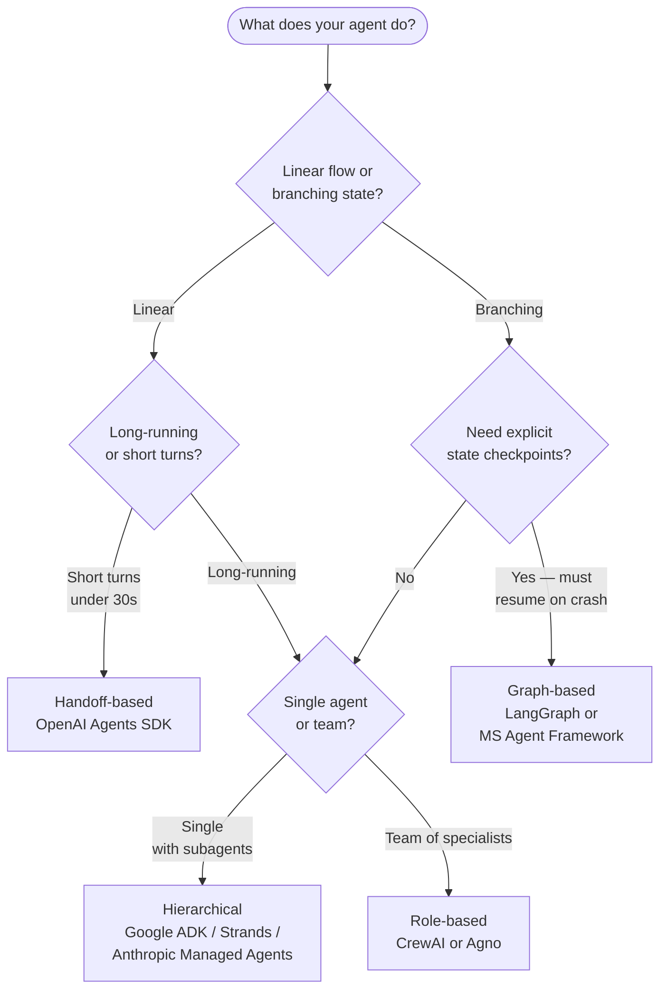

Three weeks into the new year, the most common question in my DMs is some variant of "should we use LangGraph or the OpenAI Agents SDK." It is the wrong question, asked at the wrong altitude, and answering it well requires more honesty about what you're building than most of those messages contain.

I [tested seven frameworks last week](/blog/testing-open-source-ai-agent-sdks) and ranked them. This post is the layer above that — the decision tree I use *before* picking a framework, and the four real orchestration styles those frameworks divide into. If you read one thing about agent frameworks this quarter, read this one. If you read two, read the comparison post too.

## The four styles, not six frameworks

Looking at LangGraph, CrewAI, Agno, OpenAI Agents SDK, Strands, Microsoft Agent Framework, Google ADK, Mastra, Pydantic AI, AutoGen v2, and AG2 as eleven different choices is exhausting and not actually useful. They cluster into four orchestration styles, and the style matters more than the brand.

| Style | What the agent loop looks like | Frameworks |
|-------|-------------------------------|------------|
| **Graph-based** | Explicit DAG of nodes, conditional edges, durable state per node | LangGraph, Microsoft Agent Framework, Mastra |
| **Role-based** | Cast of named agents with personas, coordinator routes by role | CrewAI, Agno, AutoGen v2 |
| **Handoff-based** | Linear chain of agents that pass control by emitting a "transfer" call | OpenAI Agents SDK, AG2 |
| **Hierarchical** | One lead agent delegates to sub-agents depth-first | Google ADK, Anthropic Managed Agents, Strands |

Once you know which style you want, the framework choice is mostly about stack alignment (AWS shop → Strands; Google shop → ADK; LangChain shop → LangGraph) and what tracing platform you've already paid for.

## The decision tree

That tree captures roughly 80% of the decisions I see teams agonize over. Walk through each question.

### Question 1: Linear or branching?

If your workflow looks like "step 1, step 2, step 3, done" — even if step 2 calls 30 tools — you don't need a graph. You need a chain with good observability. A handoff-based framework gets out of the way and lets you write the chain like normal code.

If your workflow has real branches — "if the spec exists, do A; if not, do B; if A and B disagreed, do C" — and especially if you need to *resume* from a branch after a crash or human review, you need explicit graph state.

The mistake people make: forcing a linear workflow into LangGraph because LangGraph is famous. You end up with a one-node graph and all of the graph framework's overhead with none of its benefits.

### Question 2: Long-running or short turns?

Anything that runs for more than ~30 seconds and uses any tools is a long-running agent. That's the boundary where you start to need: pause/resume, human-in-the-loop, durable state, replay-on-crash, and observability that doesn't drop on partial failures. Handoff-style frameworks (OpenAI Agents SDK) handle short turns beautifully and are awkward at the long-running end because their state is in the call stack rather than in a store.

For long-running, your real choice is between graph state (LangGraph) and hierarchical orchestration (ADK / Strands). Graph state gives you precise control over what's checkpointed. Hierarchical orchestration gives you parallelism for free.

### Question 3: Need explicit state checkpoints?

If your agent loop touches money, makes changes that are hard to roll back, or runs for hours, you need first-class checkpoint primitives. LangGraph's persistent state model — every node transition is a checkpoint, every checkpoint can be inspected, resumed, or rewound — is the strongest in the field for this. The Microsoft Agent Framework adopted a similar model and integrates better with Azure-native storage. Mastra plays in the same space for TypeScript-first teams.

If you don't need this — if your agent crashing means you re-run from the top and it's fine — don't pay the LangGraph tax. The framework is excellent at what it does, and the cost is a non-trivial conceptual ramp.

### Question 4: Single agent with sub-agents, or team of specialists?

This is the most subtle question and the one teams get wrong most often.

**Single agent with sub-agents** = there is one *Lead* the user talks to. The lead breaks the job into pieces and delegates each piece to a focused worker. The worker doesn't talk to the user or to other workers; it returns to the lead. Anthropic's [Managed Agents multi-agent orchestration](https://www.anthropic.com/news/managed-agents-2026) (public beta, May 6) ships this pattern explicitly with `depth-1` enforced as a constraint. Google ADK ships it as the default. Strands enables it via SDK-level subagent primitives. This is the right shape when one party is responsible for the answer and parallelism is for efficiency.

**Team of specialists** = there are several agents, each with a persona, that coordinate via a shared scratchpad or a router. Different specialists may directly respond to the user or to each other. CrewAI's mental model is "you have a crew with roles and they collaborate." Agno is similar with better performance characteristics. AutoGen v2 sits adjacent. This is the right shape when the *interaction between specialists* is the point — debating, critiquing, refining — rather than divide-and-conquer.

The failure mode: building a "crew" when you actually want a manager delegating to workers. You end up with three agents arguing about who handles a query and the user waits four minutes for them to converge on something the lead-agent pattern would have decided in one round.

## What changed in the last year

A few notable shifts that didn't exist when most "agent framework comparison" posts were written:

**LangGraph crossed the chasm.** The numbers Langfuse and others have been reporting — north of 47M monthly downloads, the broadest tracing integration coverage, the most production deployments in regulated industries — make it the closest thing the space has to a default. That doesn't make it right for every project. It does mean "we picked LangGraph" is the lowest-justification-required path, which is sometimes what you want.

**OpenAI Agents SDK ate the prototype tier.** For teams already on OpenAI models, the Agents SDK is now the fastest path from idea to working agent. It's deliberately opinionated, handoff-based, and tightly integrated with the Responses API. Past a certain complexity threshold you'll outgrow it — but the surface up to that threshold is genuinely productive.

**Strands matters if you're on AWS.** The Bedrock-native tracing, the OTEL-first telemetry, and the deep integration with AWS sandboxing put it ahead for AWS shops. If you'd otherwise spend two months wiring LangGraph into Bedrock and CloudWatch, Strands is the path of least resistance.

**Microsoft Agent Framework arrived.** Released in mid-2025 and matured through the year, it's now the canonical choice for Azure-first teams. The graph model is intentionally similar to LangGraph, which makes migration in either direction tractable. The Azure observability story is the strongest pitch.

**CrewAI shed its "easy but limited" reputation.** Role-based orchestration is now a respectable production choice for the right shape of problem. The token-cost overhead [reported in early 2026 comparisons](https://qubittool.com/blog/ai-agent-framework-comparison-2026) — roughly 3x simple-task tokens vs. lean frameworks — is real, but only matters at scale. For mid-size deployments it's a non-issue.

**Agno ate a chunk of CrewAI's "but I want it fast" demographic.** Sub-millisecond agent instantiation, slimmer runtime, optional managed platform. The right tool when role-based is right but CrewAI's overhead isn't.

## The framework I'd pick today

For a brand-new agent shipping in Q1 2026, my decision flow is:

1. **Is this a single-turn or short-multi-turn user agent?** OpenAI Agents SDK. Get to working in a week, plan to migrate at the long-running threshold.
2. **Is this a long-running workflow with hard branches and durable state requirements?** LangGraph, full stop. The conceptual cost is worth it.
3. **Am I on AWS and need tracing + sandboxing already wired up?** Strands.
4. **Am I on Azure?** Microsoft Agent Framework.
5. **Am I building a multi-agent debate / refinement loop where the interaction *is* the work?** Agno first, CrewAI if Agno doesn't have an integration I need.
6. **Am I shipping a Claude-first product that needs Anthropic's full stack — Skills, MCP connectors, Managed Agents?** The Anthropic platform itself, with the [skills/connectors/subagents template](/blog/skills-connectors-subagents-template) Anthropic shipped on May 5.

That's not a popularity ranking. It's a shape-matching exercise. The framework debate gets a lot less heated once everyone agrees the shape determines the answer.

## What's coming

A few things on the near horizon worth watching:

- **Cross-framework agent portability.** The early specs around an [Agent Definition Format (ADF)](https://github.com/agentic-ai-foundation/agent-definition-format) under AAIF would let an agent built on framework A be deployed on framework B with config-only changes. It's not stable yet. If it stabilizes, framework lock-in becomes a much smaller concern.
- **Graph-based handoffs.** Hybrid frameworks that present a handoff API on the outside and graph state on the inside are emerging. Expect a real "best of both" framework by mid-year.
- **The managed-platform layer.** Anthropic's Managed Agents, OpenAI's Responses-as-platform, and the increasingly serious enterprise platforms (Vellum, Voiceflow, Sema4) are turning "what framework" into "what platform" for a lot of teams. If you're a startup deciding between a framework and a platform, the question is whether you want to own your agent loop or rent it.

The framework choice matters less every quarter. The shape choice matters more. Get the shape right and the framework is the easier decision.
