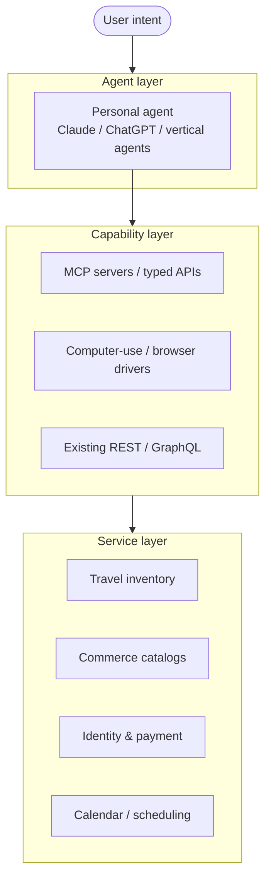

  <video
    src="/images/videos/demo-video.mp4"
    controls
    playsinline
    preload="metadata"
    style="width:100%;border-radius:0.5rem;border:2px solid var(--color-border, #e5e7eb);"
  ></video>

I had a small but telling moment last week.

I was trying to book a trip — juggling tabs, comparing dates across sites, hunting for a deal I was sure existed. The usual drill. Twenty minutes of clicks going nowhere. I stopped.

I opened Claude, typed my dates, my budget, my soft preference for a Tuesday departure, and asked for the best three options.

Five minutes later the trip was confirmed.

That gap — twenty minutes of friction vs. five minutes of intent — is the entire story. I don't hate browsing because I'm impatient. I hate it because the medium is genuinely inefficient for what I'm actually trying to do. We spent thirty years optimising the web for mouse clicks and search bars, and somewhere along the way we forgot to ask whether mouse clicks were ever the point.

They weren't. The point was: *tell the system what I need, and have it happen*. The traditional web was the best approximation of that we could build with the technology available in 1995. In 2026, it isn't anymore.

## What the trip-booking moment actually exposed

It's tempting to read this as "AI is better than websites." That framing is too soft, and it misses what's really going on. Three different things collapsed in that five-minute booking:

1. **Search → intent.** I never typed a query. I described an outcome and let the agent figure out the search.
2. **Comparison → judgment.** I didn't open ten tabs to compare prices. The agent did that and returned a ranked shortlist with its reasoning.
3. **Form-filling → execution.** I didn't fill in passenger details, billing address, seat preference. The agent had the context and acted.

Every one of those collapses replaces a *user task* with a *system task*. That's the inversion. For thirty years, websites externalised their internal work to the user — type your address into this form, click through these filters, paginate through these results, reconcile these prices in your head. The web didn't feel like work because we were used to it. It was work the whole time.

The agent-native pattern reabsorbs that work. The interface becomes the negotiation about what you want, not the operation of the system that delivers it.

## Why the traditional web feels broken now

A few specific things have changed in the last eighteen months that make the friction newly intolerable:

**Information surface area outran human bandwidth.** A typical price-comparison decision used to involve four or five tabs. Now there are dozens of providers, fare-class permutations, dynamic pricing, partner inventory, loyalty rules, regional carve-outs. The decision didn't get more complex; the data layer did. Humans don't scale to it. Agents do.

**Pages stopped being documents.** Modern destinations are React apps with infinite scroll, lazy-loaded content, cookie banners, paywalls, login walls, A/B-tested layouts, and personalised feeds. The page you see isn't the page someone else sees. Bookmarking, sharing, and even "remembering where I saw that" stopped working reliably. The web's original mental model — pages are documents, documents have addresses, addresses are stable — broke quietly.

**The cost of an agent attempt dropped below the cost of a human attempt.** This is the underrated shift. A year ago, asking an AI to handle a multi-step web task meant either it half-worked and you redid it, or you spent more time prompting than you'd have spent clicking. With computer-use models, browser-native agents, and tool-using assistants that can actually act, the breakeven flipped. The first attempt usually succeeds. When it doesn't, the fix is one sentence away.

The traditional web didn't become worse. The alternative just became better than it.

## What "agent-native" actually looks like

The phrase gets thrown around. Most of what people call "AI-native experiences" is a chat box bolted onto an existing site. That's not the shift. The shift has three honest patterns, and they're already shipping:

### 1. Computer-use agents that drive the existing web

The traditional web doesn't have to disappear for agents to take over. Anthropic's computer-use, OpenAI's Operator, browser-driving frameworks like Browser Use and Playwright-native agents — these are all bets that the *current* web is reusable as an *agent substrate*. The user expresses intent; the agent operates the page on the user's behalf.

This is the messy, transitional layer. It works because every site already has a UI. It breaks when sites have aggressive anti-bot detection, when layouts shift mid-session, or when CAPTCHAs intrude. But for a large share of "I want to do this one thing on the web" tasks, it's already good enough.

### 2. Structured agent endpoints (MCP and friends)

The cleaner shape: services expose their capabilities directly to agents. Not as scraped HTML, but as typed, authenticated, callable surfaces. The Model Context Protocol is the most visible standard for this, but the underlying idea — *let agents call you the way they call any other tool* — is bigger than any one protocol.

The implications for product teams are uncomfortable. If your service is reachable from an agent, your homepage matters less. Your filters, your nav, your "see all results" page — most of it becomes redundant. The agent doesn't need them. What matters is the contract: what intents you accept, what data you return, what side effects you guarantee.

### 3. Agent-shaped front ends for end users

Some experiences will keep a UI, but the UI will be *the agent itself*. Not a search box that calls an agent in the background — an actual conversation as the primary interaction surface, with structured affordances (cards, tables, confirmations) rendered inline when they help. This is what Claude, ChatGPT, Perplexity, and the new generation of vertical agents (travel, shopping, coding) already look like in practice. The browser becomes a runtime, not a destination.

The interesting design question isn't "chat vs. GUI." It's *which decisions deserve a GUI affordance and which deserve a sentence*. Most current AI products get this wrong in both directions — too much chat for things that should be one click, too many clicks for things that should be one sentence.

## When browsing still wins

I want to be honest about this, because the "everything becomes an agent" framing is wrong in specific cases that matter:

- **Discovery without intent.** Browsing Twitter, reading a long-form article you didn't go looking for, drifting through Wikipedia at 1am. The web is good at this and agents are not. Serendipity is a feature, and serendipity requires a surface you can wander on.
- **Trust-critical actions.** Wiring money, signing legal documents, selecting a doctor. The user wants to *see* the final state before committing. The agent can prep, but the human reads the screen.
- **Creative and exploratory work.** Design tools, code editors, video editing, music production. Direct manipulation isn't going away. What's changing is that an agent sits beside you in the tool, not that the tool turns into a chat box.
- **Tasks that are genuinely cheaper as clicks.** "Toggle dark mode," "skip to the next song," "close this tab." If the intent is shorter as a click than as a sentence, click wins.

The honest model isn't "agents replace browsing." It's "agents replace the parts of browsing that were always a tax on the user — search, compare, fill, reconcile — and the rest stays."

That tax was a much bigger share of total web time than we admitted.

## The three layers of the next decade

This is the architecture of the agentic web as it's actually rolling out. The browser isn't the centre of gravity anymore. The *agent* is. Underneath it sits a mix of structured agent endpoints (the clean future), computer-use against existing UIs (the bridge), and legacy APIs (the legacy). Underneath all of that, services compete on data freshness, action reliability, and the quality of their agent contract — not on the design of their homepage.

The middle layer is where the next big platform war happens. MCP is one entry in that race. Browser-native agent runtimes are another. Whoever owns the *protocol of agent-to-service* owns more of the future than whoever owns any individual service.

## What this means if you build software

A few uncomfortable consequences, all of which I think are real:

**SEO becomes "agent reachability."** If your service can't be discovered, called, and trusted by the personal agents the user actually talks to, you don't exist. The agent is the new search results page, and there are far fewer slots above the fold.

**The brand value of UI craft drops; the brand value of action craft rises.** A beautiful website doesn't help an agent. What helps is: predictable inventory, fast API responses, clean failure modes, honest pricing, reliable side effects. The win is *being easy to act through*, not *being pretty to look at*.

**Aggregators get either much stronger or extinct.** Aggregators that were valuable because they shoehorned ten badly-designed providers into one decent UI lose their reason to exist — the agent can shoehorn them now. Aggregators that have *inventory advantages*, *contract advantages*, or *trust advantages* get stronger because they're the agent's easiest path.

**Forms die first.** Anything that exists to translate a human-shaped intent into a machine-shaped record — flight booking forms, insurance claim forms, expense reports, tax interviews, KYC questionnaires — is the highest-friction, lowest-value-add part of the modern web. It's also the easiest to replace. Watch this category collapse in 2026.

**Native apps look more durable than websites.** The interesting twist: native apps already have the explicit "deep link / intent / shortcut" affordances that agents need to drive them. Web pages have to be inferred. An agent talking to your iPhone Shortcuts or your Android intents has a cleaner contract than the same agent driving a Chrome tab. The browser may be a stopover, not a destination.

## Is this the end of browsing?

The honest answer: it's the end of *browsing-as-work*. The trip-comparison, the price-checking, the form-filling, the cross-tab reconciliation — that whole layer of the web exists because we didn't have anything better. Now we do, and people will stop tolerating the friction faster than incumbents expect them to.

The web doesn't die. It demotes. It becomes an underlying substrate — addresses, content, transactions — that agents traverse on your behalf. The places you still *visit* are the places where the visiting itself is the point: writing, watching, learning, drifting, creating, connecting.

What's actually ending is the era when "use the web" and "get a thing done" were the same activity. They were never really the same activity; we just had no other way to express the second one. That's changing, fast.

The companies still optimising for clicks per session and time on site are optimising for a metric that's already disconnected from value. The companies optimising for *intents satisfied per second* — across whatever surface, agent, or protocol the user happens to be on — are building for what's next.

The browse-click-compare web isn't dying because AI killed it. It's dying because we finally have an interface honest enough to admit it was always a workaround.

What's your take? Which parts of the web do you think survive the shift, and which ones get quietly absorbed into the agent layer?
