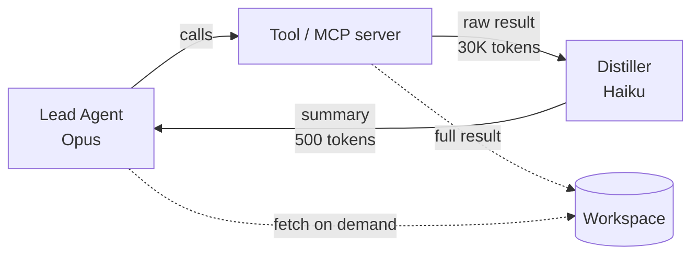

A team I worked with last quarter cut their agent's per-task cost from $0.39 to $0.037 — almost exactly 10x — without touching the model and without anyone in their user base noticing a quality drop. The savings came from four moves they made in sequence, and the moves stack in a specific order. This is the order.

I'll be specific about the numbers because the "save N% with these tips" articles are everywhere and most of them describe optimizations that buy 5% individually and don't compose. The real wins look different. They come from architectural choices that compound.

## The starting point

The baseline agent: a single Opus 4.7 agent running ReAct-style loops, accessing 23 tools via 4 MCP servers, with no caching beyond what Anthropic's API does by default. Average task: 18 tool calls, 24K input tokens cumulative, 6K output tokens. At Opus pricing that's roughly $0.39 per task. Volume: ~12,000 tasks per day. Monthly spend: roughly $140K.

A perfectly defensible agent. Also one whose finance team had questions.

## Move 1: Per-task model selection (3.1x savings)

The single biggest win. Audit every step of every task and ask: does this step actually need the strongest model?

For this agent, the audit found:

| Step type | Frequency | Strong model needed? |
|-----------|-----------|---------------------|
| Plan the task | 1/task | Yes |
| Pick which tool to call | ~18/task | No — Sonnet works |
| Parse a tool result | ~18/task | No — Haiku works |
| Synthesize the final answer | 1/task | Yes |
| Handle clarifying questions | ~0.4/task | Yes |

After the audit: the planner and synthesizer ran on Opus, tool-call decisions ran on Sonnet, parsing ran on Haiku. The agent's average cost dropped to $0.126 per task — a 3.1x reduction — without a measurable quality change on the team's eval set.

The mechanics: split the agent into a Lead (Opus) that holds the plan, an Executor (Sonnet) that handles each step's tool dispatch, and a structured-output Parser (Haiku) that normalizes tool results. This is the [deep agents pattern](/blog/deep-agents-planner-executor-critic), but the framing here isn't "for architectural cleanliness" — it's "because Haiku is 30x cheaper than Opus and most of the work is shaped like Haiku-work."

The mistake to avoid: cargo-culting "always use the cheapest model." Haiku on a planning step is a disaster. Sonnet on tool dispatch is fine. The cost lever pulls per-step, not globally.

## Move 2: Aggressive prompt caching (1.9x further savings)

After move 1, the agent ran at ~$0.126/task. After move 2, $0.066. Another 1.9x.

What changed: every part of every prompt that didn't vary across calls — system prompts, tool definitions, skill definitions, few-shot examples — got tagged for prompt caching. The Anthropic API charges 10% of normal token cost for cached input tokens. With 80% of input tokens being stable (system prompt + tools + skills), that's a roughly 70% reduction on input costs across the run.

The implementation matters. Prompt caching works only if the cached portion is at the *start* of the prompt and *byte-identical* across calls. The common failure modes:

- **Timestamp in the system prompt.** Every call has a different timestamp; the cache invalidates every call. Move dynamic content to the *end* of the prompt.
- **Tool definitions in a random order.** JSON serializers can vary order; the cache invalidates on a logically-identical change. Sort tools deterministically.
- **Skills loaded based on the user query.** Loading a different skill bundle per query means a different prompt prefix per query, which kills caching. Either load all skills (eat the context cost) or load skills *after* the cacheable portion (preserves the cache).

The team's biggest single fix: they were including the current UTC timestamp at the top of the system prompt "for logging." Moving it to the end fixed cache invalidation for 70% of their traffic. Twelve characters of change. Massive cost impact.

OpenAI's Responses API and Google's Gemini have their own caching primitives with similar trade-offs. The shape of the discipline is the same: stable prefix, deterministic ordering, dynamic content at the tail.

## Move 3: Tool-result distillation (1.4x further savings)

After move 2, the agent ran at ~$0.066/task. After move 3, $0.047.

The insight: tool results are often verbose. A SQL query returns 200 rows; the agent only needs the count. A web fetch returns a 30K-character page; the agent only needs the headline. Sending the full result to the Lead model on the next turn pays for context tokens the Lead doesn't need.

The fix: between the tool call and the Lead's next turn, insert a Haiku-powered distiller that takes the raw tool result and the original task goal and emits a compressed summary. The Lead sees the summary. The full result is stored in the workspace for the rare case when the Lead needs detail.

The cost math: a Haiku call to distill 30K tokens costs roughly the same as 5K tokens of Opus input. The Lead saves 25K tokens of Opus context. That's roughly a 5x win on each verbose tool result. In aggregate, ~30% reduction on the agent's input token spend.

The trade-off: the distiller is a step. It adds latency (small — Haiku is fast) and a place where information can be lost (real — needs care). The right mitigation is a strict structured-output schema for the distiller. The Lead asks specific questions; the distiller answers those specific questions. Vibes-based summarization here is a bug.

## Move 4: Cache the agent loop, not just the prompt (1.25x further savings)

After move 3, the agent ran at ~$0.047/task. After move 4, $0.037. The final 1.25x.

This is the one most teams skip because it requires changing how you think about the agent loop. The standard ReAct loop is: think → act → observe → think → act → observe → ... → done. Each "think" is an LLM call. If the user's next task looks similar to a recent task, the *plan* should be cacheable, not just the prompt prefix.

The implementation: hash the user's query plus the agent's current state. If the hash matches a recent cached plan, skip the planning step and replay the cached plan against the (potentially-changed) tool outputs. Re-plan only when the cached plan's assumptions are violated by what the executor finds.

This is essentially memoization for agents. It only works for workflows with a lot of plan-repetition — common in customer support, common in code review, less common in research. The team I worked with saw 27% of their tasks hit cache within a 5-minute window (similar queries from the same user). Each cache hit saves the planning LLM call entirely.

The discipline: invalidate aggressively. A stale plan applied to a changed system is worse than no plan. The safe pattern is "cache hit → quick validation step → if valid, replay; if not, fall back to full plan."

## The math of stacking

| Move | Cost per task | Cumulative reduction |
|------|---------------|---------------------|
| Baseline | $0.390 | 1.00x |
| Per-task model selection | $0.126 | 3.10x |
| Prompt caching | $0.066 | 5.91x |
| Tool-result distillation | $0.047 | 8.30x |
| Loop-level caching | $0.037 | 10.54x |

10.54x cumulative. Not by being clever in any one place — by stacking moves that each buy somewhere between 1.25x and 3.1x. The reason they stack is that they attack *different* cost drivers: model price, repeated context, verbose results, redundant computation. Each move leaves the others alone.

## The traps

A few things that didn't work, or worked less than expected:

**Switching to open-source models for cost.** The team experimented with Llama 4 70B for tool-call decisions instead of Sonnet. Token cost lower; quality drop on tool selection just bad enough that error rates climbed and the savings were eaten by retries. The frontier API models are very efficient at this specific task. Open-source is a real option for self-hosted, high-volume workloads; for API-priced calls, the savings rarely show up after retries.

**Aggressive distillation on small tool outputs.** Distilling a 200-token tool result through Haiku costs more than just sending the 200 tokens through Opus. The distillation step only pays off above ~3-5K-token tool results. Threshold the distiller; don't apply it universally.

**Prompt caching across providers.** Cache primitives don't transfer. An agent that switches between Anthropic, OpenAI, and Gemini calls based on task type loses the cache wins on every switch. If you're going to cache, pick a provider and stick with it for the cached portion.

**Storing distilled outputs in the prompt.** The naive distillation pattern keeps the summary in the agent's running prompt. After 18 steps, the prompt has 18 summaries — small individually, ~9K tokens cumulative. The smarter pattern stores the summaries in the workspace (a file) and only pulls the relevant ones into context. This is the [long-running harness](https://www.anthropic.com/engineering/effective-harnesses-for-long-running-agents) discipline applied to cost.

## What to do this quarter

If you're shipping agents and spending more than you'd like:

1. **Run the model-per-step audit first.** It's the biggest lever and the lowest engineering cost. Most teams discover they're using Opus where Sonnet or Haiku would be fine.
2. **Audit your prompt cache hit rate.** Anthropic's API exposes this. If your hit rate is below 60%, find the timestamp or the JSON ordering that's breaking the cache.
3. **Threshold a distiller for big tool results.** Anything over 3K tokens of output should go through a Haiku distiller before the Lead sees it.
4. **Measure before you cache the loop.** Loop-level caching only pays off if you have repeated plans. Measure your plan diversity; if it's high, skip this move.

The 10x number is real. It's also achievable in roughly two weeks of engineering work for a team that knows their agent's traffic patterns. The compounding is the point — each move is small individually, and stacked they shift the economics of the entire system.

Cost optimization is engineering, not magic. The teams who treat it that way pull ahead on margin and runway. The teams who don't are paying for it in cloud bills.
