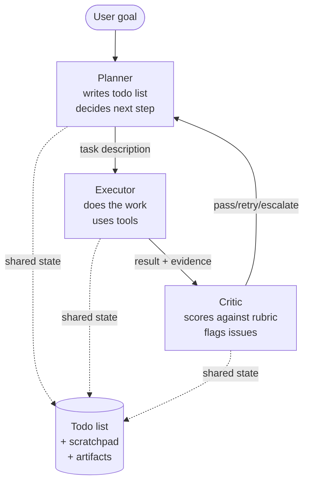

LangChain's [Deep Agents](https://www.langchain.com/deep-agents) framework went 1.0 in late January, and the shape it crystallizes — planner, executor, critic, with a shared todo list — is now the dominant pattern for any agent expected to do more than three tool calls in a row. I've spent the last six weeks rebuilding three production agents around it and the lessons are clear enough to write down.

This post is about the pattern itself, not the framework. Deep Agents is a fine implementation; the same shape appears in Manus, Anthropic's Managed Agents under different names, and a half dozen homegrown setups. What matters is the role decomposition.

## The pattern

Three roles. One shared state. A loop.

The planner is the long-lived role with the most context — it knows the goal, the plan, what's been done, what's still to do. It does not call tools. Its output is a *next-step description* and an updated todo list.

The executor is short-lived, narrow, and tool-rich. It receives a task description, executes it, and returns a structured result. It does not plan. It does not decide what to do next. It does one thing at a time.

The critic reads the executor's output and either approves it, requests changes, or escalates to the planner with a diagnosis. The critic has *evaluation tools* (run tests, validate schemas, fact-check) but does not have *write tools*.

Shared state — a todo list and a scratchpad — is the connective tissue. None of the three roles holds the full plan in its context window; the plan lives in the state.

## Why the decomposition works

Three reasons, in increasing order of importance.

**Different roles want different prompts.** A good planner prompt is "think carefully about what's needed, break it into discrete steps, prefer reversible operations first." A good executor prompt is "do exactly this task, return structured output, do not improvise." A good critic prompt is "find what's wrong, be specific, do not be polite about it." These prompts contradict each other. Forcing one agent to be all three forces a compromise prompt that's mediocre at every role.

**Different roles want different models.** The planner needs the strongest reasoning available — it makes the bet that the next step is the right next step, and getting it wrong is expensive. The executor can run on a smaller, cheaper, faster model — most tasks are mechanical given the planner's spec. The critic can also run smaller, and importantly should run a *different* model than the executor so it's not just confirming the executor's biases. Three model choices, one architecture.

**Different roles want different context.** The planner needs the goal, the todo list, and short summaries of past work. The executor needs only the current task description — feed it the full history and it gets confused. The critic needs the task spec and the output, nothing else. Separating contexts is the only way to keep total token usage tractable on long-running work.

The single-agent loop encodes all three roles into one prompt and one context. That works up to about ten tool calls in a row, then degrades. The deep agents pattern is what the field discovered when it tried to push past ten.

## What's in the shared state

The shared state is the planner's working memory and the executor's contract. It typically has three parts:

1. **Todo list** — structured tasks with status (`todo`, `in_progress`, `done`, `failed`). The planner adds and reorders tasks; the executor updates status; the critic can mark tasks failed.
2. **Scratchpad** — short summaries of completed tasks. Not the full output. The summary is what the planner sees on the next round. Full outputs go to long-term storage.
3. **Artifacts** — the actual outputs (files, data, code). Stored separately, referenced by ID. Pulled into context only when a specific task needs them.

The discipline is keeping the planner's context bounded. A planner that sees the full output of every task degrades within 20 tasks. A planner that sees one-line summaries can run for 200 tasks without drift. The scratchpad is the load-bearing data structure.

## When to use this pattern

The pattern is correct when:

- The goal can't be reached in a small fixed number of steps
- Sub-tasks can be described independently (executor doesn't need full plan context)
- Some sub-tasks are verifiable (critic has something concrete to check)
- The cost of a wrong step is high enough to justify a critic

It's wrong when:

- The work is short, linear, and well-specified (one agent is fine, simpler is better)
- The user is in the loop on every step (the planner just adds latency)
- The tasks are inherently sequential with strong dependencies (the critic loop doesn't compose)
- Verification is harder than execution (the critic adds cost without catching errors)

The most common misuse: applying deep agents to chat. Most chat doesn't benefit from a critic; the user *is* the critic, in real time. The pattern shines on autonomous or semi-autonomous workflows where the human reviews the *end product*, not each step.

## The critic is the part everyone underbuilds

Most "deep agents" I've seen in the wild have a strong planner, a competent executor, and a critic that's basically `score this 1-10`. That critic is useless. It approves things it shouldn't and rejects things it should approve, because "score this" is the kind of vague instruction LLMs are bad at.

A useful critic has three properties:

**Rubric-based, not vibe-based.** The critic prompt should list specific checks: does the output satisfy the schema, does it cite sources for claims, does the code compile, does the test pass. Each check returns pass/fail and a reason. The critic doesn't score; it inspects.

**Tool-equipped for verification, not for fixing.** The critic should be able to run tests, parse outputs, query data sources to verify claims. It should not be able to modify the work. Separation of concerns is what makes the critic trustworthy.

**Model-different from the executor.** If the executor runs on Sonnet, the critic runs on Opus or Haiku — anything *other than* Sonnet. Same-model critics share blindspots with the executor. The Anthropic [Outcomes primitive](/blog/code-with-claude-2026-recap) (public beta from May 6) explicitly recommends a different model for the critic, and the recommendation is correct.

This is the place where applying microservices instincts — clear contracts, narrow responsibilities, fewer privileges — pays off most. The critic is a worker; treat it like one.

## The patterns that ship

A few concrete patterns I've seen work in production:

**The pre-flight planner.** Before any executor task runs, the planner writes a full todo list and the user (or a downstream system) reviews it. Once approved, execution runs unattended. This gives human review without per-step interruption — the right trade-off for tasks that take 20+ minutes.

**The critic-with-retry-budget.** When the critic fails an executor's output, the planner tries again with feedback. After N retries, the task is escalated — either to a human or to a different planning approach. The retry budget is a hard limit; without it, the loop can spin indefinitely on impossible tasks.

**Skill-aware planning.** The planner has access to a list of *available skills* (in the [Anthropic Skills](/blog/skills-connectors-subagents-template) sense) and writes plans that reference them. The executor loads the relevant skill for each task. This couples the deep-agents pattern with skill-based prompting and produces noticeably better plans because the planner now knows what's possible.

**Memory-backed planning.** The planner reads from cross-session memory (see [Agent Memory Just Became Infrastructure](/blog/agent-memory-becomes-infrastructure)) when starting work. Past plans for similar goals seed the new plan. This is where the offline reflection / Dreaming primitive starts to compound — the planner gets better at planning over time, without the model changing.

## What the frameworks ship

A quick survey of how the major frameworks implement this:

| Framework | Planner | Executor | Critic | Shared State |
|-----------|---------|----------|--------|--------------|
| LangChain Deep Agents | First-class node | Sub-agent dispatch | Configurable | TodoTool + state |
| Anthropic Managed Agents | Lead agent | Subagents (depth-1) | Outcomes primitive | Steering events |
| OpenAI Agents SDK | Lead with handoffs | Specialist agents | Custom guardrails | Conversation thread |
| Manus / Browser Use | Internal planner | Browser actions | Internal verifier | Workspace files |
| Strands | DAG nodes | Tool nodes | Custom callbacks | Bedrock-backed state |

The shapes converge. The names differ. The pattern is the abstraction; the framework is the implementation detail.

## What deep agents don't fix

For honesty: this pattern is not a free lunch.

**Latency.** Three roles serially is three LLM calls per step. Even with parallel sub-tasks, the planner sits on the critical path. For interactive use, this is the wrong shape past a certain step rate. The fix isn't to remove the critic; it's to parallelize the executor and batch the critic's work.

**Cost.** Three calls per step is three calls' worth of tokens. The per-task model selection helps. So does aggressive caching. But the floor is meaningfully higher than a single-agent loop, and that floor needs to be justified by the failure modes the pattern catches.

**Plan brittleness.** A planner that writes a 20-step plan and then doesn't revise it is exactly the kind of agent that fails halfway through. Good planners re-plan continuously based on what the executor finds. Brittle planners commit early and can't recover. The discipline is in the planner prompt; the constraint is in how often the planner gets to re-plan.

**Cross-role miscommunication.** The most common failure mode I see: the planner writes a task description that's clear to the planner and ambiguous to the executor. The executor does the wrong thing. The critic approves the wrong thing. The plan is wrong from there. The fix is structured task contracts — the planner's output isn't a sentence, it's a schema with explicit inputs, expected outputs, and success criteria.

## What to do this quarter

If you're shipping agents and haven't adopted the pattern:

1. **Start with the planner-executor split.** Add the critic last. The two-role version is meaningfully simpler and captures most of the win. Critic without strong roles below it is a distraction.
2. **Build the shared state structure first.** The todo list is the load-bearing data structure. Get its schema right, get the read/write semantics right, then layer the roles on top.
3. **Use a different model for the critic than the executor.** This single rule catches more bugs than any other discipline in the pattern.
4. **Bound the planner's context.** It should see the todo list, the scratchpad, and the goal — not the full task outputs. If your planner context grows past ~10K tokens by step 20, something is wrong.

The pattern is becoming the default for a reason. It's the shape that survives once you push past short, well-specified tasks into the messy, multi-step, partially-reversible work that production agents actually have to do. Three roles, one state, a loop. That's the architecture.
