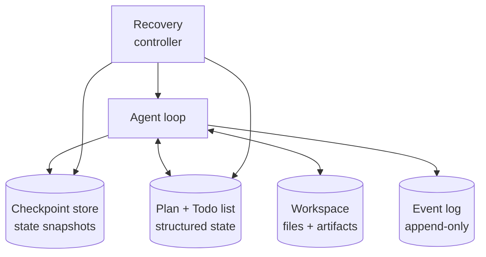

The longest agent run I've personally orchestrated this month was 6 hours and 41 minutes. It started at 11pm, ran overnight, and produced 23 pull requests by morning. About forty minutes in it crashed, restarted from a checkpoint, and the user (me, asleep) never knew. About four hours in it hit a tool failure, retried with backoff, and continued. By 5am it was waiting on a CI run for one of its earlier PRs; it polled until the run finished and continued.

A year ago this kind of run would have been a demo with caveats. Today it's just an agent doing its job. The shift is mechanical, and the mechanism is the *harness* — the layer of state management, checkpoints, and recovery that sits between the agent loop and the runtime. Long-horizon agents are not a model story. They're a harness story, and the harness is the part most teams don't engineer.

This post is about that harness — what it does, what it has to handle, and the specific patterns that survive contact with multi-hour runs.

## What "long-horizon" means

For specificity: long-horizon means tasks that run for more than ~15 minutes and involve more than ~50 LLM calls. Below that threshold, you can mostly get away with treating an agent as a single process holding everything in memory. Above it, the failure modes change.

Three things break at scale:

**Context windows fill up.** Even a 1M-token context is finite. A run with 200 tool calls, each producing a moderate amount of output, fills any window. The naive response — summarize when full — drops detail. The right response — externalize state to a workspace — requires harness support.

**The runtime crashes.** Networks blip. API providers throttle. Hosts restart. A 6-hour process that crashes at hour 4 needs to resume from somewhere other than the start. Without checkpointing, every long run is a coin flip against the underlying infrastructure's reliability.

**The plan goes stale.** A plan written at hour 0 isn't necessarily valid at hour 4. Tool outputs have shifted, the user's instructions might have been clarified, dependencies have come and gone. The agent needs to re-plan, not just execute.

The harness handles all three. The agent loop handles the LLM and tool calls. The split is what makes long-horizon work tractable.

## The harness primitives

A minimum-viable long-horizon harness has five primitives:



**1. The workspace** — a filesystem (or filesystem-like store) the agent reads and writes. Tool outputs over a size threshold get written to files; the agent's context holds *references* to the files, not their contents. Without this, you can't run for hours.

**2. The plan / todo list** — structured state, separate from the LLM context. The agent reads it, writes to it, and uses it as the source of truth for "what's done, what's next." If the agent crashes and resumes, the plan tells it where to pick up.

**3. The checkpoint store** — periodic snapshots of the agent's state (workspace + plan + recent context summary). At least one checkpoint per major plan step; ideally one every N minutes regardless.

**4. The event log** — append-only record of everything that happened. Tool calls, LLM calls, plan updates, errors, retries. Used for debugging and for resume logic.

**5. The recovery controller** — the piece that detects crashes, restores from the latest valid checkpoint, and resumes the agent. Often the trickiest part — what counts as a "valid" checkpoint isn't obvious.

The pattern is borrowed from databases (write-ahead log + checkpoint), distributed systems (state snapshots), and unix tooling (journaling filesystems). The agent loop is the application logic. The harness is the OS the application runs on. The mistake everyone makes is treating the harness as an afterthought.

## What goes in checkpoints

The checkpoint question is the one most teams get wrong. The naive checkpoint captures *everything* — the full context, the full workspace, the full event history. This works for short runs and fails at scale because checkpoint creation gets slow and resume gets fragile.

The right checkpoint captures three things:

**The plan and todo list** — the structured "where am I" state. This must always be in checkpoint; the recovery logic needs it to decide what to do next.

**Workspace deltas, not contents** — by reference, not by value. The workspace is its own persistent store; the checkpoint records *which files* are part of the state at this point, not their contents. (Unless your workspace is itself volatile, in which case you need a different design.)

**A summary of recent context** — the last few turns, distilled. The LLM context isn't recreated verbatim on resume; it's regenerated from the plan + workspace + summary. This is the key insight: the context is a *view* of the state, not the state itself.

Anthropic's [long-running harness work](https://www.anthropic.com/engineering/effective-harnesses-for-long-running-agents) from November 2025 and the [follow-up in March 2026](https://www.anthropic.com/engineering/harness-design-long-running-apps) lays this out in detail. The pattern they document — a `claude-progress.txt` file that the agent reads at the start of every session and writes to as work progresses, combined with git commits as checkpoints — is the simplest working version. Production harnesses elaborate on it; the core idea is identical.

## Resume is not restart

When a long-running agent crashes, you have two recovery options:

**Restart** — throw away in-flight work, start the agent over from scratch. Simple. Catastrophic for 4-hour runs.

**Resume** — restore from a checkpoint, regenerate the LLM context from durable state, continue. Complex. The whole point of the harness.

Resume has subtleties. The agent's last in-flight action might have partially completed — the tool call succeeded but the agent crashed before processing the result. Did the action happen? Should it be retried? The harness needs to know.

The pattern that works: every action the agent takes goes through a wrapper that records *intent* before execution and *outcome* after. On resume, the recovery controller looks at the event log for the last recorded intent. If there's no matching outcome, the action might or might not have happened — treat as ambiguous, ask the agent to verify. If there's a matching outcome, the action completed, skip it.

```python
def execute_with_intent(action, args, event_log):
    intent_id = event_log.record_intent(action, args)
    try:
        result = action.execute(args)
        event_log.record_outcome(intent_id, "success", result)
        return result
    except Exception as e:
        event_log.record_outcome(intent_id, "failure", str(e))
        raise
```

The pattern looks trivial. The discipline to apply it everywhere, including tool calls that the framework doesn't natively wrap, is where most homegrown harnesses fall down.

## The replan moment

Long-running agents need to *re-plan*, not just execute. The plan written at the start of the run made assumptions that might not be true at hour 3. Tool outputs reveal facts the plan didn't account for. The user might have provided clarification mid-run. The world changes.

Healthy long-horizon agents have explicit replan triggers:

- After every N executed steps (e.g., every 5 todo items)
- When a critic fails an output and the failure is structural
- When a tool returns "this is impossible" in a way that's not retry-fixable
- On explicit user input
- At fixed time intervals (every 30 minutes)

Replanning costs an LLM call — usually a Lead-tier model. It's not free. Skipping it is the failure mode where the agent finishes work the user didn't want anymore. Doing it constantly is the failure mode where the agent re-decides the plan and never makes progress. The right rate is workload-specific; the right discipline is making it explicit.

## What the runtime layer ships

A quick survey of how the major runtimes ship long-horizon support:

**Claude Managed Agents.** [Multi-agent orchestration](/blog/code-with-claude-2026-recap) provides parent-child agent semantics; the platform handles checkpointing and resume implicitly when agents idle for long-running work. Steering events let external systems push instructions mid-run. Hour-plus runs are the design point.

**OpenAI Agents SDK.** The [recent evolution](https://openai.com/index/the-next-evolution-of-the-agents-sdk/) added explicit long-horizon support — sandbox agents that can run for hours, persistent state via the Responses API, an explicit pause/resume primitive. Strong infrastructure; opinionated about the loop shape.

**LangGraph.** Persistent state was the design point from day one. Checkpoint primitives are first-class. Resume from any node. The trade-off is that LangGraph's conceptual model — explicit DAGs, explicit state schema — requires more upfront design than the alternatives. Pays off for long-running work.

**Strands.** Bedrock-backed state, OTEL tracing, durable workspaces. The AWS-native answer. Solid for AWS shops; less compelling otherwise.

**Homegrown.** Most teams I see with truly long-running production agents have a homegrown harness on top of one of the runtimes. The runtime gives them the loop; the harness gives them the workspace + checkpoints + recovery. The reason for homegrown is usually integration with existing internal infrastructure (their queue system, their state store, their identity model). The shape is the same; the components are different.

## The failure modes

Three failure modes worth flagging explicitly because they're the ones that bite teams who didn't expect them:

**Context drift.** The agent's context, regenerated from state on each resume, doesn't exactly match the context the agent had pre-crash. The agent might make a slightly different decision than it would have. Over a long run, these small differences accumulate. The mitigation: log the agent's *intent* at every replan point in structured form, not just the LLM's free text. On resume, the recovery controller can verify the agent's new intent matches the recorded intent.

**Cost runaway.** A long-running agent that gets stuck in a retry loop or a planning oscillation can burn through significant compute before anyone notices. Hard caps on total runtime cost, with circuit-breaker logic that pauses the agent for human review when the cap is approached, are not optional. The number of teams that have learned this the expensive way is uncomfortable.

**Tool freshness.** A tool result obtained at hour 0 might be stale at hour 4. An agent that didn't refresh its data is an agent that made decisions on old facts. The discipline: tag every tool result with a timestamp and a freshness policy. The agent should know which results need refreshing.

## The patterns that ship

A few concrete patterns I've seen working in production long-horizon agents:

**The progress journal.** A file the agent writes to as it works, in addition to the structured todo list. The next session — same agent, new context — reads the journal as part of its priming. This is the simplest working version of cross-session continuity and the one Anthropic [documents](https://www.anthropic.com/engineering/effective-harnesses-for-long-running-agents) explicitly. Add it before adding anything more elaborate.

**Git as the workspace.** For coding agents, the git repo is the workspace. Every checkpoint is a commit. Resume is `git status` + `git log`. The agent's progress journal is literally the commit messages. This is so much simpler than custom persistence that it's surprising more teams don't use it.

**Steering events.** The user (or an external system) can push instructions to a running agent without restarting it. The agent reads pending steering events at the top of each loop iteration. Anthropic's Managed Agents ship this as a platform primitive; for homegrown setups, a poll-based steering channel is straightforward to add.

**Graduated checkpoints.** Lightweight checkpoint after every step; full checkpoint every N minutes. Lightweight checkpoints capture only the plan + workspace pointers. Full checkpoints capture summaries and metadata. Resume tries the lightweight checkpoint first; falls back to the full one if the lightweight is corrupt.

**Heartbeat-and-revive.** A separate watchdog process monitors the agent. If the agent stops emitting heartbeats, the watchdog initiates resume. Adds a small amount of complexity; catches the failure mode where the agent process is technically alive but stuck.

## What to do this quarter

If you're approaching long-horizon territory:

1. **Externalize state before you cross 30 minutes.** Workspace files + structured todo list. The earlier you do this, the less retrofitting you'll do later.
2. **Wrap every action in an intent/outcome pattern.** Even when the framework doesn't require it. Recovery quality is the dividend.
3. **Cap total runtime cost with a circuit breaker.** Hard limit on total tokens and total runtime. Auto-pause when approached.
4. **Add the progress journal pattern even on short runs.** It compounds. By the time the runs get long, the journal discipline is already there.
5. **Use git as your workspace if the work is code-shaped.** Don't reinvent persistence.

Long-horizon agents are the part of this field that's moved fastest in the last year. The model improvements helped — longer contexts, better planning — but the bigger story is that the harness layer matured. The pattern is now well-known; the tooling is real; the failure modes are documented. There's no excuse for an agent that can't survive a network blip in May 2026, and the teams that take the harness seriously are the ones who'll be running unattended overnight workflows by the end of the year. The rest will still be staring at "context window exceeded" errors at 3am wondering why their agent gave up.
