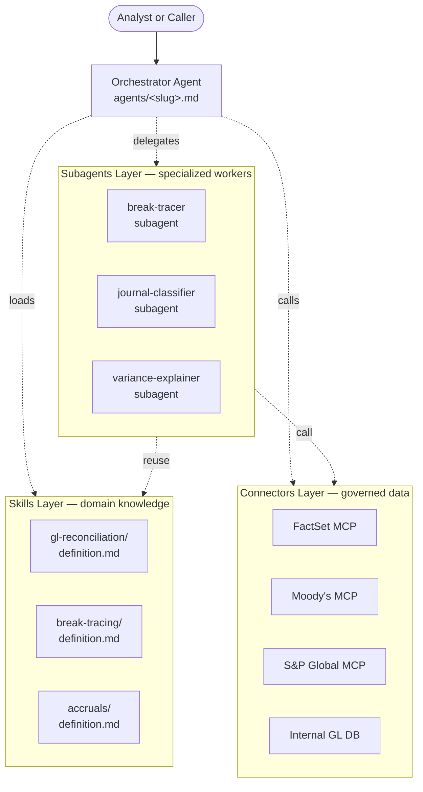
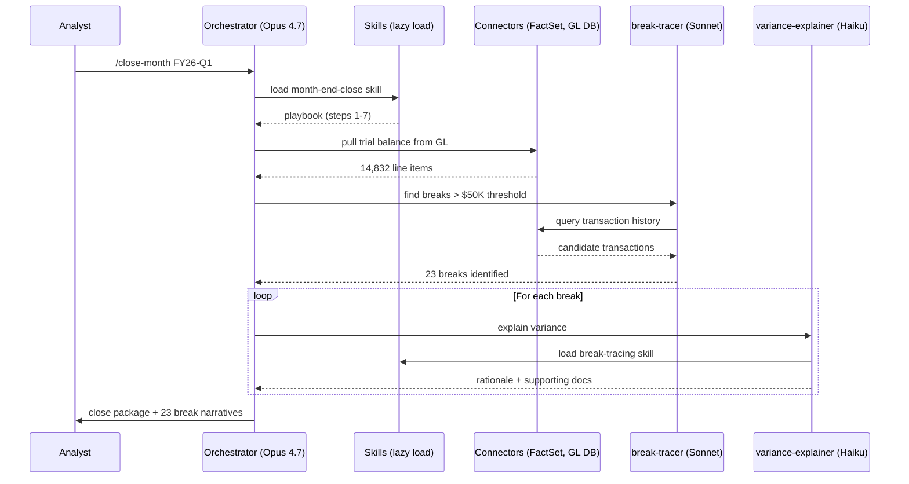

On May 5, 2026, Anthropic [released ten ready-to-run agent templates](https://www.anthropic.com/news/finance-agents) for financial services — pitchbook builders, KYC screeners, month-end closers, statement auditors. The headline reads like a vertical play. It isn't.

Underneath, Anthropic shipped a *pattern*: every template is built from the same three pieces — **skills**, **connectors**, and **subagents** — wired together by a thin orchestrator. The [open-source cookbook](https://github.com/anthropics/financial-services) lets you read the entire structure, file by file. And once you see it, you start to notice the same three-layer shape forming everywhere — in Claude Code plugins, in Cursor, in the enterprise agent platforms that have been shipping all year. This post walks through what each layer actually does, why this decomposition matters, and what it does *not* solve.

## The change

The announcement bundles three things that are easy to conflate:

1. **Ten finance-specific agent templates.** Pitch builder, meeting preparer, earnings reviewer, model builder, market researcher (research & coverage); valuation reviewer, GL reconciler, month-end closer, statement auditor, KYC screener (finance & ops).
2. **Three deployment surfaces.** Each template ships as (a) a Claude Code / Claude Cowork plugin that runs alongside an analyst, (b) a Claude Managed Agent that runs autonomously, and (c) a cookbook you can fork and customize.
3. **A repeated architecture.** Every template is a `manifest.json` + an `agents/<slug>.md` system prompt + a `skills/` directory + a `commands/` directory + a `.mcp.json` declaring connectors. The Managed Agent version adds an `agent.yaml` orchestrator and a `subagents/` directory of leaf workers.

The first two are the announcement. The third is the actual news. The repo is, in effect, the first widely-distributed reference implementation of a layered agent template — a template format that other vendors will copy, the same way the OpenAPI spec became the template format for REST.

## The mechanism

Here's how the layers fit:



Three things are worth noticing immediately. First, the orchestrator doesn't *contain* domain knowledge — it *references* it through skills. Second, connectors are reusable across templates (the `financial-analysis` plugin centralizes all 11 data connectors and inherits them into every dependent template). Third, subagents are not just "the same agent recursed" — they're distinct, narrow workers with their own prompts that the orchestrator delegates to.

Let me walk each layer.

### Layer 1: Skills

A skill in this repo is a markdown file at `plugins/vertical-plugins/<vertical>/skills/<skill-name>/definition.md`. No build step. No code. Just structured prose that tells Claude *how* to do a specific thing the way your firm does it.

For the GL reconciler template, the skill tree looks like:

```
plugins/agent-plugins/gl-reconciler/skills/
├── gl-reconciliation/definition.md
├── break-tracing/definition.md
└── accruals/definition.md
```

Each `definition.md` is a self-contained playbook: when to invoke this skill, what the inputs look like, what steps to follow, what edge cases exist, what the output format should be. The orchestrator loads them lazily — skill descriptions sit in the system prompt as one-liners, full content gets pulled into context only when the model decides the skill applies to the current task.

This matters because it solves a real production problem: **firm-specific conventions are the part that breaks every demo**. The "right" way to trace a break in a GL reconciliation isn't in any model's training set. It's in a runbook someone wrote five years ago that lives in a Confluence page. By making the skill a fork-and-edit markdown file, the firm-specific layer becomes versionable, reviewable, and swappable without touching the orchestrator.

It also keeps token cost honest. A skill *description* is maybe 200 tokens. Skill *content* is loaded only when invoked. A template with 20 skills costs ~4K tokens of overhead even if no skill is in use — and full skill load only happens for the one or two that fire on a given task. Compare to dumping every relevant document into the system prompt and praying.

### Layer 2: Connectors

This is the most-underrated layer in the design. A connector is an MCP server entry in `.mcp.json`, but with a critical property: **it's named, governed, and reused across templates**.

The `financial-analysis` plugin defines all 11 data connectors in one place:

| Provider | MCP URL |
|----------|---------|
| Daloopa | `https://mcp.daloopa.com/server/mcp` |
| Morningstar | `https://mcp.morningstar.com/mcp` |
| FactSet | `https://mcp.factset.com/mcp` |
| Moody's | `https://api.moodys.com/genai-ready-data/m1/mcp` |
| S&P Global (Kensho) | `https://kfinance.kensho.com/integrations/mcp` |
| PitchBook | `https://premium.mcp.pitchbook.com/mcp` |
| LSEG | `https://api.analytics.lseg.com/lfa/mcp` |
| Aiera | `https://mcp-pub.aiera.com` |
| Chronograph | `https://ai.chronograph.pe/mcp` |
| MT Newswires | `https://vast-mcp.blueskyapi.com/mtnewswires` |
| Egnyte | `https://mcp-server.egnyte.com/mcp` |

Every dependent agent inherits these via plugin composition. You don't re-declare them per template. That's the same instinct as DNS being a separate concern from your app config — connectors are infrastructure, and treating them as inheritable resources (rather than per-agent tool lists) is what makes the template format actually scale across an enterprise.

Worth flagging what this is *not*: it's not a permission model. The connector entry itself is just a URL. The governance lives one layer up — in the MCP server's own auth layer, and in whatever scoping the firm wires in front of it. The template format gives you the seam where governance plugs in. It doesn't give you the governance for free. Anyone planning to deploy this in a regulated environment will spend the bulk of their time on that seam, not on the skills.

### Layer 3: Subagents

The Managed Agent cookbook flavor of each template adds an explicit subagent layer:

```
managed-agent-cookbooks/gl-reconciler/
├── agent.yaml                      # orchestrator definition
├── subagents/
│   ├── break-tracer.yaml
│   ├── journal-classifier.yaml
│   └── variance-explainer.yaml
├── examples/
│   └── steering-events.json
└── README.md
```

The shape here is deliberately shallow: depth-1 only. The orchestrator can call subagents; subagents do not call other subagents. That's a real design choice — it bounds the call graph, makes the tool surface in the orchestrator's context predictable, and lets each subagent be deployed and versioned independently. Deeper trees are tempting and almost always make debugging miserable.

Each subagent has its own system prompt, its own allowed skills, and crucially, its own model choice. A `variance-explainer` doing structured numerical comparison can run on a cheaper model than the orchestrator. A `break-tracer` chasing through transaction logs might need the strongest available. Cost optimization stops being a global parameter and becomes a per-task choice. This is the same trick microservices played with per-service hardware sizing — applied to LLM inference.

Here's a sketch of what a single month-end-close run looks like end-to-end:



The orchestrator is the one holding the high-level plan in context. Subagents are stateless workers that get a tight prompt and a tight output contract. Skills are referenced material that loads on demand. Connectors are the I/O layer.

You can squint at this and see a classic three-tier web app: presentation (orchestrator), business logic (skills + subagents), data (connectors). That analogy is closer than it should be. The reason enterprise teams will adopt this faster than they adopted earlier agent patterns is not that it's revolutionary — it's that it's *familiar*.

## Why it matters

Three things this unlocks:

**Customization without forking the model.** Every firm has its own variance threshold, its own break-tracing convention, its own KYC risk scoring. Pre-template, customizing meant editing one giant system prompt and praying the rest of the behavior didn't shift. Post-template, you swap a skill file. The orchestrator and subagents stay generic. The vendor ships a baseline; the firm ships a delta.

**A marketplace surface.** Plugins, skills, and connectors are independently distributable. Partner-built plugins (LSEG, S&P Global) ship in the same repo as Anthropic's reference templates. Expect a long tail of vendor-published skills (compliance, jurisdiction-specific accounting rules) and connectors (proprietary data providers) to follow. The reason is structural: the format makes third-party distribution possible without requiring those vendors to ship a full agent.

**Per-layer evals.** A single agent is an eval nightmare — you can grade the final output but you can't isolate what failed. With layers, you can eval each one independently. Does the orchestrator pick the right skill? Does the subagent produce the right output given a fixed input? Does the connector return expected data? The layers create natural seams to test at, which is the kind of unglamorous infrastructure work that actually decides whether a system survives in production.

## What it doesn't solve

**Latency across layers.** Every subagent call is a full LLM round-trip. A workflow that delegates to three subagents serially pays three sequential inference times. For analyst-in-the-loop work, this is fine. For voice agents or anything with a hard latency budget, this design will hurt — the orchestrator-subagent boundary is the wrong abstraction when sub-500ms matters.

**Long-horizon context.** Subagents are stateless by default. State lives in the orchestrator. For a half-hour reconciliation that touches hundreds of transactions, the orchestrator's context window becomes the bottleneck and the failure mode. Anthropic's own [long-running harness work](https://www.anthropic.com/engineering/effective-harnesses-for-long-running-agents) (the `claude-progress.txt` + git checkpoint pattern, November 2025) and the [follow-up on harness design](https://www.anthropic.com/engineering/harness-design-long-running-apps) (March 2026) sit *outside* this template format. Combining them is left as an exercise. It will not be trivial.

**Connector governance.** As noted above, the format gives you a seam, not a guarantee. The hard part — credential scoping, audit logging, PII redaction, jurisdiction routing — happens in the MCP servers themselves and the policy layer the firm wires around them. The template format doesn't make any of this easier; it just makes it possible to add it without re-architecting the agent.

**Debug-across-seam.** When the answer is wrong, which layer broke? The orchestrator picked the wrong skill? The skill content was stale? The subagent ignored part of its prompt? The connector returned partial data? Each layer needs its own observability story, and the cross-layer trace is where most teams will spend their evals budget. There is no shortcut here.

## What to watch next

A few things on the near horizon worth tracking:

- **Does OpenAI converge?** OpenAI's [recent harness work](https://www.epsilla.com/blogs/2026-04-16-openai-harness-vs-claude-mcp) has emphasized state snapshots and multi-sandbox parallelism over composable templates. Whether GPT-5's agent platform adopts a similar skills/connectors/subagents decomposition or doubles down on its own primitives will tell us a lot about whether this layering is a stable abstraction or a transient one.
- **The depth-1 subagent constraint.** Anthropic explicitly limits subagents to depth-1. If long-horizon workflows demand depth-2 or arbitrary trees, expect the format to bend — or expect orchestrators to grow planner-style internal state to compensate.
- **Skills as a marketplace.** Anthropic shipped these as a public cookbook. The question is whether third parties — compliance vendors, accounting standards bodies, jurisdiction-specific data providers — start publishing skills against this format. If they do, the format becomes a de facto standard. If they don't, it stays Anthropic-shaped.
- **Eval tooling for templates.** Per-layer evals are the unlock. Whoever ships the per-layer test harness — fixture-based connector mocks, skill-invocation tracing, subagent output contracts — owns the production story for this pattern.

The financial services templates are the launching surface. The architecture underneath is the part that will outlast them.
