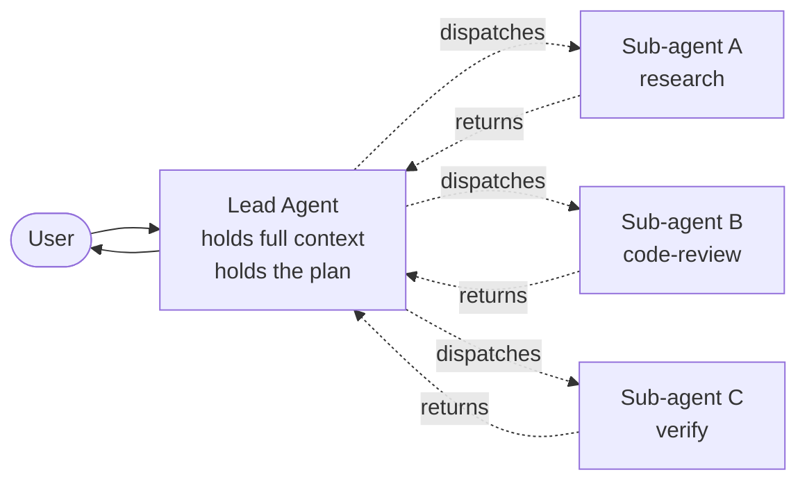

A year ago, "build an agent" meant build one prompt-tool loop and tune it. Today, every serious agent framework — Claude Code, OpenAI Agents SDK, Strands, Google ADK, LangGraph — ships a sub-agent primitive as a first-class concept. The orchestrator-worker pattern won, decisively and quickly, and the parallel to the microservices wave of the mid-2010s is too close to ignore.

This post is about why the pattern took over, what it actually unlocks, and the specific failure modes that — like microservices — most teams will discover the hard way.

## What the pattern actually is

A sub-agent is a separately-invoked LLM call with its own system prompt, its own tool surface, and its own model choice, called by a parent agent to do a narrowly-scoped task. The parent stays in its loop; the sub-agent returns a structured result. That's it.

In Claude Code, sub-agents are markdown files in `.claude/agents/<name>.md` with a YAML frontmatter declaring the tools and model. The Lead agent reads the description, decides this task matches, dispatches via the `Task` tool, gets back a tool result. In OpenAI Agents SDK, sub-agents are first-class objects that the runtime hands off to via a `transfer_to_agent` call. In Strands, you wire sub-agents as Python objects with an explicit `as_tool()` adapter. The mechanics differ. The shape is identical.

The sub-agents in this diagram are *peer workers* — they don't talk to each other, they don't accumulate state, they don't even know the others exist. The Lead is the only thing that holds the plan and the cross-task state. That constraint matters, and we'll come back to it.

## Why the pattern won

Three forces drove sub-agents from edge case to default in twelve months. I'm convinced any one of them would have made the pattern popular; together they made it dominant.

**Context budget.** A 200K-token context window sounds enormous until you've used one. A long research task fills it in twenty tool calls. A coding task fills it faster. The first thing sub-agents buy you is that the worker context is *separate from the parent context*. The Lead doesn't see the 5,000 tokens of raw HTML the research sub-agent waded through; it sees the 80-token summary the sub-agent returned. Cross-session memory helps with this on one axis; sub-agents help with it on the orthogonal axis.

**Per-task model selection.** Anthropic's [skills/connectors/subagents template](/blog/skills-connectors-subagents-template) made this visible at the architecture level, but it's been quietly happening in production for a year. The Lead runs on Opus 4.7 because it needs the planning capacity. The variance-explainer sub-agent runs on Haiku because it's structured comparison. The break-tracer sub-agent runs on Sonnet because it needs more reasoning than Haiku and the structured-output discipline of a smaller model. Cost optimization stops being a knob and becomes a property of the architecture.

**Parallelism.** Anthropic's [Managed Agents multi-agent orchestration](https://www.anthropic.com/news/managed-agents-2026) — shipped at Code with Claude on May 6 — lets the Lead dispatch multiple sub-agents simultaneously. A research task that would have been three sequential web fetches becomes one parallel dispatch. Wall-clock latency drops in ways that are visible to users. The OpenAI Agents SDK's `Parallel` primitive ships the same idea. LangGraph's `Send` primitive does too.

These three together are what microservices delivered in the backend world: independent scaling, independent technology choices, parallel execution. The shape that worked there works here too, for the same structural reasons.

## What changes when you have sub-agents

The interesting effects aren't the obvious ones. Once your agent has a Lead and a stable of workers, *what the Lead does* changes.

A single-agent prompt has to encode every behavior. The Lead prompt in a sub-agent system delegates most behaviors and only encodes *coordination*. Lead prompts get shorter, less surface-specific, more about plan-and-decide. The cognitive load of "this prompt has to know how to do every job" disappears, and the Lead can be tested on a different axis: does it pick the right worker?

A second effect: per-layer evals. Single agents are eval nightmares because you can grade the final output and nothing else. Sub-agent systems give you natural test seams. You can mock the sub-agents and unit-test the Lead. You can fix the Lead and integration-test each sub-agent. Per-layer evals are the unglamorous infrastructure work that decides whether a system survives production, and sub-agents make them tractable for the first time.

A third effect: caching wins compound. Sub-agent prompts are static and short. Their system prompts cache aggressively. A Lead that invokes the same sub-agent 30 times in a session pays the system-prompt token cost once. In real workloads that adds up to 30-50% cost reduction in a way single-agent designs simply can't match.

## The microservices analogy taken seriously

If the comparison holds, the failure modes will too. They are.

**Failure mode 1: Sub-agent proliferation.** Three months in, you have 47 sub-agents. Nobody remembers what `research-helper-v2` does differently from `research-assistant-final`. The Lead's prompt is a 4,000-token catalog of when to call which one. This is the same trap microservices hit when teams created a service per noun. The fix is the same: ruthless consolidation, naming discipline, and treating sub-agents as a *cost* paid for a *benefit* rather than a free abstraction. If you can't describe a sub-agent's value in one sentence, it shouldn't exist.

**Failure mode 2: Distributed-trace bankruptcy.** When a single agent fails, you read its trace and find the bug. When a Lead-plus-four-sub-agents system fails, the trace is across five separate LLM contexts that have to be stitched together to make sense. Observability that works for single agents falls over for sub-agent trees. Langfuse, Phoenix, and the OTEL GenAI semantic conventions are catching up, but the experience as of February 2026 is still painful. You need a tracing platform that understands parent-child spans across LLM contexts, and you need it before your third sub-agent.

**Failure mode 3: The "wait, who owns this" question.** When the Lead delegates a job to a sub-agent and the sub-agent's output is wrong, two things might have happened. The Lead might have given the wrong prompt. Or the sub-agent might have done a bad job with a good prompt. Distinguishing these requires data and discipline, and most teams skip the discipline part. Six months in, your incident postmortems are full of "we couldn't tell whether the Lead or the sub-agent was at fault" and your fixes are guesses.

**Failure mode 4: Coordination is the bottleneck.** The Lead is a single sequential decision-maker. Parallelism inside a sub-agent dispatch is free. Parallelism *across* dispatches is bounded by how often the Lead re-decides. For long-running tasks, the Lead becomes the slowdown — same way an API gateway becomes the bottleneck of a microservices stack. The defenses are the same: minimize work the Lead does itself, fan out earlier, and resist the temptation to make the Lead smart at every step.

**Failure mode 5: Cross-agent state lives in the Lead's context, which is finite.** This is the one that bites long-running workflows hardest. A reconciliation that touches 800 records and calls a sub-agent per record cannot keep all 800 sub-agent outputs in the Lead's context window. You hit summarization, lose detail, and the Lead's plan drifts. The fix is structural — sub-agents that write to durable shared state (a file, a database) and a Lead that reads back the summary, not the raw output. This is the [long-running harness](https://www.anthropic.com/engineering/effective-harnesses-for-long-running-agents) problem, and it's not solved at the sub-agent primitive level.

## Patterns that work

A few concrete patterns I've seen ship reliably:

**The verify-second-opinion.** After the Lead does anything risky, dispatch a `verifier` sub-agent that re-reads the work and either approves or returns a list of issues. The verifier has a strict prompt, no write tools, and a different model than the Lead. This catches a surprising number of "the Lead was confident and wrong" failures. Anthropic's [Outcomes](https://www.anthropic.com/news/managed-agents-2026) primitive (public beta, May 6) is essentially this pattern blessed by the platform.

**Fan-out-fan-in research.** When the Lead needs to gather information from many sources, dispatch a sub-agent per source in parallel. Each sub-agent returns a structured summary. The Lead synthesizes. This is the right shape for any "research this topic" workflow and the wrong shape for any task with strong sequential dependencies between sources.

**The narrow specialist with golden eval set.** For any sub-agent you call hundreds of times, build a fixture-based eval suite for that sub-agent specifically. Unit-test it in isolation. Catch regressions before they get integrated. This is the practice microservices teams arrived at — service-level testing decouples release cycles — and the same logic applies. Sub-agents you can't unit-test are sub-agents you can't safely change.

**The Lead is the integration test.** Don't let the Lead's prompt grow without bound by adding "when you see X, do Y" rules. Instead, fix the failure at the sub-agent level. The Lead's prompt should describe coordination only. If it's describing domain behavior, the wrong layer is doing the work.

## What to actually do this quarter

If you're shipping agents now:

1. **Adopt the pattern, with discipline.** Sub-agents are a real win; sub-agent sprawl is a real cost. Three sub-agents you can describe in one sentence each will outperform ten you can't.
2. **Invest in cross-agent tracing before you have three sub-agents.** Langfuse, Phoenix, or Braintrust — pick one, wire it up, and make sure the parent-child relationship is visible. Debugging without this is a non-starter.
3. **Use per-task model selection.** This is the lowest-effort, highest-impact win in the entire pattern. The variance-explainer doesn't need Opus. Use Haiku. Save the cost.
4. **Treat the Lead's prompt as the most important file in your codebase.** It is. Review it like code, test it like code, version it like code. The Lead's quality is the ceiling on the whole system.

The microservices comparison is genuinely instructive, including the warnings. Backend teams spent a decade learning what microservices were good at and what they weren't. Agent teams are about to compress that decade into a year. Skip ahead by taking the lessons seriously: composition is power, composition is cost, and the discipline you apply to the composition is the thing that decides whether the system is a win or a tax.
