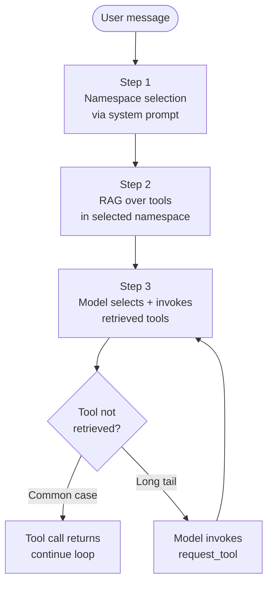

The numbers I've been collecting from production agent deployments over the last six months tell a consistent story. Up to about 30 tools, an agent picks the right one at >95% accuracy. From 30 to 100, accuracy drops to roughly 80%. Past 100, it's somewhere between 60% and "depends what model you're using and which way the wind is blowing." At 200 tools — a number every multi-server MCP deployment is now reaching — you have what is technically called a problem.

The naive fix is to send all 200 tool definitions to the model and hope. This works in demos and fails in production. The not-naive fix is to treat tool selection as an explicit sub-problem in the agent loop, and to engineer it the way you'd engineer search or routing in any other system. This post is about what that engineering actually looks like.

## Why it falls apart

Two failure modes compound past the 30-tool mark, and they're worth distinguishing.

**Context bloat.** A typical MCP tool definition with name, description, and JSON schema runs 400-800 tokens. 200 tools is 100K+ tokens of overhead in your system prompt before the user has said anything. Cache hits help, but every tool-list change invalidates the cache. The Cloudflare numbers — 1.17M tokens for their 2,500-endpoint API — are the extreme case; the median case is still bad.

**Decision degradation.** Even within budget, models start to fail at selecting between tools when the option space gets large. The failure mode isn't picking the wrong tool — it's hallucinating tools that don't exist, calling tools with arguments meant for similar-sounding other tools, or repeatedly calling the same tool because "did I already do this" becomes hard to track. The [DeepMind retrieval-augmented tool selection paper](https://arxiv.org/abs/2509.21891) from Q3 2025 measured this carefully — accuracy degradation is roughly linear in log(N) up to about 50 tools, then drops off a cliff.

These two failure modes interact. Bigger tool lists make decisions worse *and* eat your context budget *and* burn cache hits *and* slow responses. There is no incremental fix; there's only the architectural one.

## The four approaches

Production teams converge on one or more of four techniques. They compose.

### 1. Tool namespacing

The cheapest fix and the one most teams skip. Group tools by namespace, expose namespaces in the system prompt, and only expand a namespace into individual tools when the model asks to. Anthropic's Claude has supported this via the [tool-use beta header](https://docs.anthropic.com/en/api/agent-skills) since November 2025. OpenAI's Agents SDK supports it via the `tool_choice` mechanism with explicit groups.

Mental model: instead of 200 tools at the top level, expose 12 namespaces — `github`, `slack`, `database`, `cloudflare`, etc. The model picks a namespace first, then sees that namespace's 15-30 tools. Context drops from ~100K to ~12K. Decision accuracy goes back up because the model is choosing 1-of-12 then 1-of-20 rather than 1-of-200.

This is the lowest-effort, highest-impact intervention if you're past the cliff and haven't done anything. Most teams underestimate it because it sounds too simple to matter.

### 2. RAG-over-tools

Treat tool selection as a retrieval problem. Embed every tool description. At each step, embed the user's request, retrieve the top-K most relevant tools, present those to the model.

The mechanics:

```python
# index built once, refreshed when tools change
tool_index = embed_tools(all_tools)

def select_tools(user_query, conversation_state, k=15):
    query_embedding = embed(user_query + conversation_state.last_actions)
    candidate_tools = tool_index.search(query_embedding, k=k)
    return candidate_tools
```

The trick — and where most implementations fail — is *what you embed*. Embedding the tool name alone is useless (names are unique tokens that don't generalize). Embedding the description alone misses how the tool composes with other tools. The pattern that works best is embedding name + description + 2-3 example invocations + linked-tool names. Tools become more findable when they tell you what they do *and* what they do near.

The second trick is *what you embed against*. The naive query is "user's last message." The better query is "user's last message + conversation state summary + last 3 tool calls." Tool selection isn't just about the immediate user intent; it's about what the agent's doing right now.

RAG-over-tools usually buys back the 30-100 tool zone — i.e., it raises accuracy in that zone close to the small-N baseline. It does not solve the >100 zone alone.

### 3. Dynamic tool loading

Instead of presenting tools statically, let the model *request* tools at runtime. The system prompt advertises that this is possible. When the model needs a tool it doesn't see, it calls a `request_tool(name_or_description)` meta-tool. The runtime resolves and adds the tool to the next turn.

The mechanics are subtle. The model needs enough hint in the system prompt to know what's available — typically a one-line catalog of namespaces and capabilities — without seeing every tool. The `request_tool` call gives the model a way to expand the option space on demand without paying for it upfront. The OpenAI Agents SDK ships this as a `runtime_tools` configuration; LangGraph implements it as a custom node; the Claude Agent SDK's tool-loading hooks make it natural.

Dynamic loading is the right shape when *most* tasks use a small predictable subset of tools and *some* tasks need a tool from the long tail. The long tail doesn't pay context tax for the common case.

### 4. Tool aggregation (Code Mode)

Don't expose 200 fine-grained tools. Expose 2-5 coarse tools that compose internally. Cloudflare's [Code Mode](/blog/mcp-too-many-tools-problem) is the canonical version of this: instead of 2,500 endpoints as 2,500 tools, expose `search` (find an endpoint) and `execute` (run JavaScript against the API). The agent's reasoning becomes "what do I need" + "write code to get it," not "pick the right tool from a menu."

The trade-off is that the agent now has to write code, which is a different kind of reasoning than tool selection, and one that requires sandboxing to be safe. Code Mode is a great fit for API-shaped tools and a poor fit for tools that genuinely have a small bounded action space.

Tool aggregation works at *server design* time, not at orchestration time. If you're the consumer of someone else's MCP server, you can't aggregate their tools without forking. This is why the most leveraged work in the MCP ecosystem right now is encouraging server authors to ship Code-Mode-style designs.

## How to combine them

In production, teams that have solved this run a stack:



Roughly: namespacing prunes the option space coarsely. RAG-over-tools prunes finely. Dynamic loading handles long-tail cases. Code Mode is what you push your MCP server vendors toward when their surface is the problem.

A real example: a team I work with runs an agent against 11 MCP servers exposing ~340 tools total. Without engineering, they were at ~62% tool-selection accuracy. After namespacing alone, 81%. Add RAG-over-tools, 91%. Add dynamic loading for ~20 long-tail tools, 94%. Each layer bought ~10 percentage points. Stacking them stopped being optional once they crossed 100 tools.

## The traps

**Trap 1: Re-embedding on every turn.** RAG-over-tools wants a fresh retrieval per turn, but embedding the user query + state takes time. If you naively await embedding on every loop iteration, the agent feels slow. Cache embeddings of stable tool descriptions; precompute query embeddings for short user inputs; batch retrievals where possible.

**Trap 2: Description drift.** Your tool descriptions are doing dual duty — describing the tool to the model *and* serving as retrieval keys. These two roles want different optimization. The fix is to maintain a parallel "retrieval description" — a richer text used for embedding — separate from the model-facing description. Most teams discover this need around the 50-tool mark and wish they'd designed for it from the start.

**Trap 3: Namespacing without a router.** Just listing namespaces in the system prompt without a router still asks the model to do the routing. That works for small namespace counts (under ~8) and falls apart fast. Past that, run a small dedicated classifier to pick the namespace, then invoke the agent with that namespace expanded.

**Trap 4: Forgetting that MCP servers can hide tools too.** The MCP protocol lets a server return different tool lists based on the client's session. A well-designed MCP server can do its own filtering before the client ever sees the tool. This is underused. If you control the MCP server, push tool selection logic into it — it's cheaper there than in the agent loop.

## What changed in the last six months

A few notable developments worth knowing:

**The DeepMind paper.** [Retrieval-Augmented Tool Selection](https://arxiv.org/abs/2509.21891) (Sep 2025) is the most-cited reference on this topic and worth reading end-to-end. The key result: RAG-over-tools recovers most of the accuracy lost between 30 and 200 tools, and the recovery scales with the quality of the retrieval setup, not the model.

**Anthropic's Agent Skills.** Released in [October 2025](https://docs.anthropic.com/en/api/agent-skills) and matured through Q1 2026, Skills are essentially "tool sets you can load on demand." A skill bundles tools, examples, and prompt fragments and can be loaded by the agent at runtime. This is dynamic loading with batteries included.

**MCP capability negotiation.** The MCP spec added a `tools/listChanged` notification — the server can announce when its tool surface changes, and the client can refresh its retrieval index. Sounds boring; matters a lot for long-running agents whose available toolset shifts mid-session.

**OpenAI's Agents SDK tool selection middleware.** The SDK's middleware layer now supports tool filtering as a first-class step. You can run RAG-over-tools without writing the integration yourself. The hook-based design is similar to LangGraph's middleware in concept.

## The honest summary

Tool selection at scale is engineering. It's not a model problem you can wait out. The frontier models in February 2026 are *better* at large tool surfaces than the models from a year ago, but the gain is logarithmic while the surface is growing linearly with MCP adoption. The gap widens.

Treat tool selection as a sub-problem with its own architecture. Namespace your tools. Build a retrieval layer. Add dynamic loading for the long tail. Push your MCP server vendors toward aggregation. Each of these costs less than the alternative — running a 200-tool agent on hope and apologies — and the costs compound the other way too. Investments here pay off every turn of every conversation.

The 200-tool agent is here whether you're ready or not. The question is whether you've done the engineering or you're about to learn why everyone who shipped one in 2025 spent Q1 rewriting.
