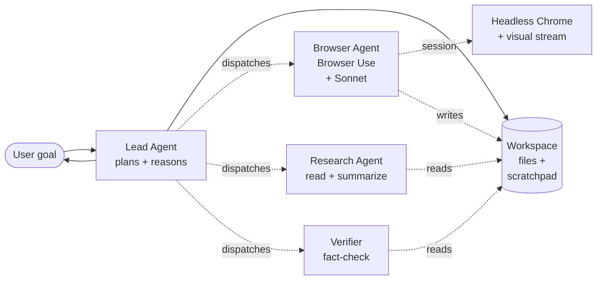

OpenAI killed Operator on August 31, 2025. I want to start there because it's the part of the story everyone forgets, and the lesson it teaches is the most important one in this space. Operator was the splashy launch that put browser agents on the map — and it shipped, struggled with the long tail of the open web (CAPTCHAs, complex JavaScript flows, session quirks), and got shut down inside seven months. Meanwhile [Browser Use](https://github.com/browser-use/browser-use), an MIT-licensed Python library that didn't get a press tour, hit 40,000 GitHub stars and quietly became the substrate every other web agent now sits on top of.

The lesson: in agent work, the demo is the easy part. The long tail of the open web is what kills products. Six months later, the field has converged on a small set of approaches that survive that long tail, and a much larger set of approaches that don't. This is the field report.

## The substrate consolidated

The interesting development of late 2025 is that web agents stopped being a competition between integrated products and became a competition between *substrates*. Three options matter:

**Browser Use** (open source, Python, MIT). The "Linux of web agents." It exposes a clean Playwright-backed API with semantic page understanding (DOM + accessibility tree + screenshot), a structured action space, and good telemetry. Every agent author who isn't building their own bottom layer is using Browser Use. Manus is built on it. Workflow automation platforms are built on it. The hosted Browser Use Cloud has the install base.

**Anthropic Computer Use** (proprietary, integrated). Different shape — sees pixels, controls mouse/keyboard. Better for tasks where the page semantics aren't well-structured (canvas apps, image editors, custom widgets). Worse for high-volume web automation where DOM semantics are cheaper than vision.

**OpenAI's deprecated approach**, plus successors. After Operator's shutdown, OpenAI rolled the browser-control capabilities into the Responses API as `web_actions` tools. Lower-level than Operator, no opinion on the agent loop. Solid for teams already on OpenAI, less of a story for everyone else.

If you're starting today, the answer is roughly: Browser Use for high-volume DOM-driven workflows, Computer Use for tasks the DOM can't describe, and "build your own" only if you have a really good reason. The library investment in Browser Use makes "build your own" a lonely path.

## What killed Operator (and what you should learn from it)

Operator's failure modes were a public catalog of everything hard about web agents:

**CAPTCHAs.** Every serious checkout flow has one. Operator couldn't reliably solve them. Modern agents either route through a human handoff for CAPTCHAs (Manus, Browser Use Cloud) or use specialized solvers (NopeCHA, 2Captcha) gated by explicit user consent. The vibes-based "the agent will figure it out" approach doesn't survive contact with real e-commerce.

**Session and state quirks.** Logged-in flows, JavaScript SPA hydration, race conditions on dynamic content. Operator handled the happy path; the long tail of "the page mostly works but sometimes the cart button takes 800ms to enable" defeated it. Browser Use's approach — explicit `wait_for_stable` actions, robust retry with backoff — is more verbose but actually works.

**Selectors that change.** A button that's `#checkout-2024-v3` today is `#checkout-2025-redesign` next week. Operator's reliance on stable DOM positions was a tax that compounded. Browser Use's semantic locators (find by accessibility role, text content, neighbor structure) survive redesigns better.

**Cross-origin and iframe chaos.** Payment widgets, embedded widgets, third-party logins. The boundary between "your agent controls the browser" and "your agent controls *this* widget inside the browser" is where most production failures happen.

The agents that ship in 2026 take all of these seriously as engineering problems. The agents that died treated them as model problems and waited for a smarter model.

## Manus: the case study

[Manus AI](https://manus.im/) is worth dwelling on. It's the first browser-driven agent product that crossed the "actually completes real tasks for real users" threshold, and the design choices behind that are instructive.

The architecture (publicly described in their March engineering writeup): Lead agent on Claude Opus, sub-agents on Sonnet, browser layer via Browser Use, a structured workspace where the agent stores files and intermediate results, and a real-time visual stream so the user can watch what's happening. The visual stream is the part that gets attention; the workspace is the part that matters.

The workspace is what lets Manus do long-running tasks. The agent doesn't keep everything in its context — it writes results to files, reads them back when needed. This is the [long-running harness pattern](https://www.anthropic.com/engineering/effective-harnesses-for-long-running-agents) applied to browser work. A research task that touches 30 pages doesn't carry 30 page-contents in context; it writes summaries to files and the planner reads the index.

The visual stream matters for a different reason: it lets the user *interrupt early*. When the agent is heading the wrong direction at minute 4 of a 20-minute task, the user can step in. Web agents that hide their work get blamed for going off-rails. Web agents that show their work get steered. This is a UX insight as much as a technical one.

Manus's Browser Operator, [available to all users since November 22, 2025](https://manus.im/blog/manus-browser-operator), turns any Chrome window into an agent-controlled session. The growth since then has been the kind of growth Operator was supposed to have.

## The benchmarks

Two benchmarks worth knowing:

**WebArena Live** — successor to the original WebArena, runs against actually-live websites (with permission). Tracks task completion rate, time to completion, and (a new metric) user-interruptable steps. Top of the leaderboard as of March: Manus at 73.4%, Browser Use Cloud at 71.1%, Browser Use OSS + Claude Sonnet at 64.8%, Computer Use + Claude Opus at 58.3% (held back by tasks where DOM was cheaper than vision). Most other entrants are below 50%.

**ReWeb-2026** — Carnegie Mellon's benchmark for agents on the messy long tail (multilingual sites, sites with poor semantic markup, sites with aggressive anti-bot measures). Leaderboard is much tighter and much lower in absolute numbers — top score is 41%. The gap between WebArena Live and ReWeb is the gap between "happy path" and "the actual internet."

If you're evaluating a web agent for production, run it against ReWeb-style inputs. The WebArena numbers tell you the floor. ReWeb tells you the ceiling.

## What the production agents actually look like

A composite of three production web-agent deployments I've seen up close:

Notes on this shape:

- The browser sub-agent runs on Sonnet, not Opus. Browser tasks are mostly mechanical given a clear spec.
- The workspace is the shared state. The Lead doesn't see HTML; it sees the summaries the browser sub-agent wrote to files.
- The verifier reads from the workspace and either approves the result or sends the Lead back to fix issues.
- The visual stream is wired to the user, not the agents. It's a UX surface, not part of the agent loop.

The shape is the [deep agents pattern](/blog/deep-agents-planner-executor-critic) specialized for web work. Once you see it, it's everywhere.

## The trade-offs nobody puts in the demo

A few things that don't fit in a launch video but matter a lot in production:

**Cost per task.** A single Manus-style task can be 20-80 LLM calls and 5-30 minutes of headless Chrome time. The cost per task lands somewhere between $0.30 and $4.00 depending on complexity. That's fine for high-value tasks (procurement, research, scheduling). It's a non-starter for high-volume cheap tasks (running 10,000 form submissions). Choose the work accordingly.

**Failure mode visibility.** When the agent fails, *what* failed? Was the plan wrong? Did the browser miss a click? Did the verifier accept a bad result? Cross-layer observability is harder for web agents than for any other category of agent because the layers are heterogeneous (LLM + browser + DOM + page-state). Invest early in trace stitching. Langfuse and Phoenix have caught up on this in Q1 2026; LangSmith is still catching up.

**Site terms-of-service.** Some sites prohibit automated access. Some only when the automation isn't disclosed. The legal layer of web agents is moving fast — the EU AI Act enforcement that started in February 2026 explicitly treats undisclosed agent traffic as a category. If you're building a web agent at scale, the headers it sends and the consents the user gives matter. This is not lawyer-bait; it's actual engineering.

**The cost of human review.** "Human in the loop" sounds free until you measure it. A reviewer who has to watch a 10-minute agent task and approve the result is a reviewer who can only do 30-40 tasks a day. That's the throughput constraint of the entire system. Either reduce the per-task review cost (smaller, cheaper reviewable units) or accept the throughput.

## Where this goes next

A few things on the near horizon:

**The browser-native protocol.** There's a stalled-but-active proposal for browsers to expose a `webdriver-v2` API specifically for AI agents — structured DOM access, intent-based actions, opt-in declarative permissions. Chrome has shipped origin trials. If this lands, the Playwright-based substrate becomes legacy and a new round of agent platforms emerges on top of the native API.

**Better long-tail handling via models.** Some of what killed Operator is genuinely a model problem — visual reasoning over messy pages is hard. As multimodal capability improves, the substrate burden shifts back from "Browser Use + careful engineering" to "Computer Use + smarter model." Don't bet on this entirely, but don't bet against it either.

**Agent-friendly site protocols.** A small but growing set of sites are publishing structured agent endpoints — essentially MCP servers — alongside their human UIs. Booking.com, Linear, Notion, GitHub. When the option exists, agents prefer the structured endpoint to the browser. The browser-driven path becomes the fallback, not the default. This is the part of the web agent story that makes [MCP](/blog/mcp-ecosystem-crossed-inflection-point) and web agents converge.

## What to do this quarter

If you're shipping or evaluating web agents:

1. **Pick Browser Use unless you have a specific reason not to.** The substrate consolidation is real. Don't build the bottom layer; build the agent on top of it.
2. **Build a workspace, not a context-stuffer.** Page contents go to files. The planner sees summaries. The agent reads files when it needs them. This pattern is non-negotiable past about 10 pages.
3. **Wire up a visual stream from day one.** The UX cost of building it after launch is huge; the UX benefit of having it from launch is huge. This is the cheap thing that distinguishes shippable from impressive.
4. **Run ReWeb-style evals, not just WebArena.** Your benchmarks decide what bugs you find. Use benchmarks that surface the long-tail bugs.

The state of the art in March 2026 is "production-grade for high-value tasks, expensive and slow, getting better fast." That's a better state than the field has ever been in. Whether your specific application clears the bar is a question of task value, throughput, and the engineering discipline you're willing to invest in. Operator's lesson is that none of those substitute for each other.
